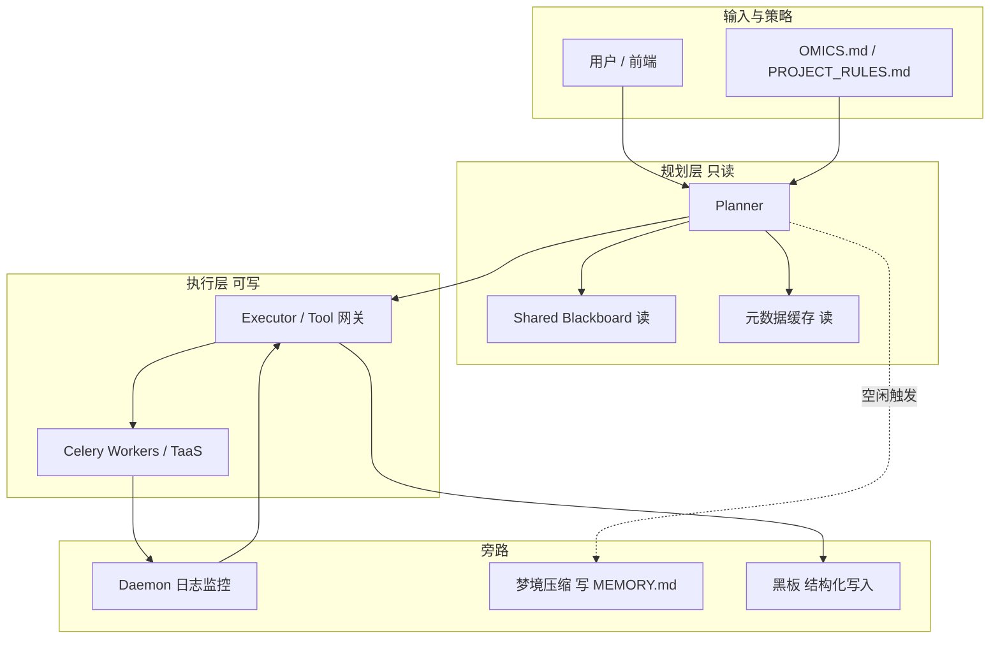

# Omics Agent V3 架构升级核心提案摘要

**副标题**：基于下一代多智能体操作系统理念的生信 AI 演进

---

## 文档用途

本文档包含两部分：**六大模块提案摘要**（可直接当需求口径），以及**可行性报告与实施计划**（架构思路、技术可行性、分阶段路线、风险应对）。表述刻意压扁，只保留可执行信息。

---

## 背景

当前 Omics Agent 已具备 Tool-RAG 与领域智能体（Domain Agents）的扎实基础。为解决生信分析中「长周期、重计算、跨模态、高试错」等痛点，拟借鉴业界前沿的 AI 操作系统架构思路（如 Claude Code 核心机制），对系统进行深度重构：从「被动响应工具」升级为「全自动生信研发团队」。

---

## 核心升级模块（六大特性）

### 1. 记忆引擎升级：梦境压缩（autoDream）与自愈内存

**当前痛点**

- 长周期生信探索（如单细胞降维聚类反复试错）会产生大量中间日志，导致 LLM 上下文溢出、核心生物学假设被遗忘。

**架构方案**

- 实施「严格写入纪律（Strict Write Discipline）」：仅将执行成功且具有生物学意义的结论写入核心上下文。
- 开发后台「梦境」机制：在系统空闲时由后台 Agent 将冗长试错对话压缩为高密度的轻量级索引文件（如 `MEMORY.md`），供后续会话快速恢复记忆。

**预期收益**

- 缓解长会话「变笨」问题，显著降低 Token 消耗。

---

### 2. 跨组学协同：跨智能体共享黑板（Shared Blackboard）

**当前痛点**

- RNA、代谢组等领域智能体之间存在「知识壁垒」，难以开展真正的多组学联合分析。

**架构方案**

- 在 Celery 等异步架构之上，建立类似 `tengu_scratch` 的全局共享暂存区。
- 要求各领域 Agent 在规划前读取该区域，并将关键发现（如差异基因、富集通路）以结构化格式（JSON/XML）写入，实现跨任务知识共享与交叉验证。

**预期收益**

- 打破单组学孤岛，支撑多智能体协同推演。

---

### 3. 任务监控：主动守护模式（Daemon / KAIROS）

**当前痛点**

- 生信重计算任务（比对、GWAS 等）耗时长；若因 OOM 等异常中断，用户往往滞后感知，浪费大量时间。

**架构方案**

- 部署常驻后台守护智能体（Daemon Agent），静默监控集群/容器日志。
- 捕获异常（如 `MemoryError`）后主动分析、自动调整参数（如提高内存申请）并重试任务。
- 向前端推送轻量提示，尽量不打断用户心流。

**预期收益**

- 提升无人值守分析能力与任务成功率，改善体验。

---

### 4. 安全与权限：Master-Worker 读写隔离与高危拦截

**当前痛点**

- 若赋予 AI 过宽的绝对文件权限，存在误删或损坏珍贵原始数据（如大型 FASTQ/BAM）的风险。

**架构方案**

- **权限降级**：规划器（Planner Agent）强制为只读（READ-ONLY）。
- **高危拦截**：在执行器（Executor）执行文件覆盖或删除前，经轻量级风险分类器（如 YOLO Classifier）评估；高危操作强制触发 Human-in-the-loop（人工确认）。

**预期收益**

- 在保障数据安全的前提下，尽可能释放自动化能力。

---

### 5. 极速响应：容忍轻微过时的元数据缓存

**当前痛点**

- 生信数据体积大（可达数十 GB），规划前若每次都实时读取完整文件状态（MD5、维度等），延迟极高。

**架构方案**

- 不追求绝对实时新鲜度；建立异步更新的本地元数据缓存（SQLite / Redis 等）。
- Agent 规划时优先读取缓存状态（允许轻微过时），将响应从分钟级压缩到秒级。

**预期收益**

- 提升交互流畅度，减少等待焦虑。

---

### 6. 个性化适配：项目级「基因注入」（Project-level Injection）

**当前痛点**

- 不同课题组对流程、参数与工具有强烈偏好，目前往往需在 Prompt 中反复说明。

**架构方案**

- 支持在项目根目录解析 `OMICS.md` 或 `PROJECT_RULES.md`。
- 系统在组装 Prompt 时动态、无缝注入本地规则（例如「强制使用 Harmony 做批次校正」），覆盖默认行为。

**预期收益**

- 无需改底层代码即可贴近各实验室 SOP（标准作业程序）。

---

## Omics Agent V3：可行性报告与实施计划

### 1. 整体架构图设计思路

**数据流一句话**：用户请求 → **只读规划**（读黑板 + 读元数据缓存 + 读 `OMICS.md`）→ 生成任务图 → **可写执行**（Celery/Worker 跑重活）→ 结果写黑板与资产总线；**旁路**为 Daemon 盯日志与重试、空闲进程写 `MEMORY.md`、缓存异步刷新。

**示意图（逻辑拓扑，非部署图）**：

**设计要点**：规划与执行进程分离；黑板与缓存是**跨会话、跨领域**的唯一交汇面；高危写操作集中在执行层并过策略闸门。

---

### 2. 分模块技术可行性（对齐现有栈：Python、Celery、LLM、Omics 资产总线）

**模块 1 — 记忆引擎**

- **做法**：对话落库（已有则复用）+ 定时/低优队列 Celery task：截取「成功步骤 + 结论」摘要，LLM 压成条目化 `MEMORY.md`（或 SQLite 表）；主会话启动时把 `MEMORY.md` 摘要块 prepend 到 system 侧或 RAG 检索。
- **栈**：Python；Celery `beat` 或队列延迟任务；与现有 SSE/会话存储对接即可。
- **边界**：摘要必须带 `run_id`/时间戳，避免把失败尝试当真理写进长期记忆。

**模块 2 — 共享黑板**

- **做法**：Redis 命名空间或对象存储前缀 `blackboard/{project_id}/`，值用 JSON Schema 固定字段（领域、基因列表、通路 ID、版本、父任务 ID）；Planner 工具 `read_blackboard` / Worker 结束钩子 `append_finding`。
- **栈**：Redis（低延迟）或现有消息后端；Celery chain/chord 在任务完成时写一条。
- **边界**：写前校验 Schema；大表（全矩阵）不进黑板，只进资产总线路径引用。

**模块 3 — Daemon / KAIROS**

- **做法**：独立轻进程 tail 容器 stdout/结构化日志（JSON 行）或订阅 Celery `task_failure`；规则层匹配 `MemoryError`、exit code、关键词；映射到「降并发 / 加大 mem / 换队列」等预设策略后 `retry`；SSE 推一条非模态通知。
- **栈**：Python `asyncio` 或 sidecar；不改 Worker 镜像也可先做日志侧。
- **边界**：自动重试次数上限 + 熔断，防止死循环烧钱。

**模块 4 — 读写隔离与高危拦截**

- **做法**：Planner 侧文件工具绑定只读根；Executor 侧单独 token/能力列表；删除与覆盖走 `pre_exec`：路径规则（原始数据目录只读）、扩展名、大小阈值 → 不通过则挂起任务等用户点确认。
- **栈**：现有 Executor 反射/工具注册处加一层策略；无需引入「视觉 YOLO」，**命名保留为轻量分类器即可**，实现上用语义规则 + 可选小文本分类模型。
- **边界**：人类确认队列要有超时与审计日志。

**模块 5 — 元数据缓存**

- **做法**：后台 inode/mtime/size/可选抽样维度写入 SQLite；Planner 只查表；文件变更由 inotify 或任务完成事件触发增量更新；显式 `stale_before` 字段让模型知道可能旧几秒到几分钟。
- **栈**：SQLite + Worker 钩子；可选 Redis 做热路径。
- **边界**：强一致场景（例如刚写完的 h5ad）在工具返回里带 `artifact_id`，规划器优先信工具输出而非缓存。

**模块 6 — 项目级注入**

- **做法**：解析项目根 `OMICS.md`（约定 frontmatter 或固定章节）；在 `build_system_prompt` 或等价入口拼接；与现有架构宪法并存时，**文档声明优先级**（项目规则 vs 全局默认）。
- **栈**：纯 Python 文件读取 + 缓存 mtime。
- **边界**：单文件大小上限，防止 prompt 被撑爆。

---

### 3. 实施路线图（Phase 1–3）

| 阶段 | 目标 | 交付物（可验收） |
|------|------|------------------|
| **Phase 1** | 低风险、立刻减负 | 元数据缓存表 + Planner 读缓存；`OMICS.md` 注入；Executor 删除/覆盖策略闸门 + 审计日志 |
| **Phase 2** | 跨任务与无人值守 | 黑板 Redis/Schema + 任务结束写回；Daemon MVP（失败分类 + 有限重试 + SSE 提示） |
| **Phase 3** | 长会话质量 | 梦境压缩任务 + `MEMORY.md`/表；严格写入纪律与主对话摘要联动；可选加强分类模型 |

---

### 4. 潜在技术风险与应对

| 风险 | 应对 |
|------|------|
| 缓存与真实文件不一致导致错规划 | 工具层返回 `artifact_id` 优先；缓存带 `stale_before`；写后失效相关 key |
| 黑板写成垃圾场、Schema 失控 | 强 Schema + 版本字段 + 定期清理任务 |
| Daemon 误重试放大故障 | 重试上限、指数退避、同类错误熔断、关键错误只通知不重试 |
| 记忆摘要幻觉污染后续分析 | 摘要只引用已持久化产物路径与日志片段 ID；人工可删 `MEMORY.md` 条目 |
| Planner 只读后无法「自举」新目录 | 显式「初始化项目」工具仍走执行层，不破坏只读规划原则 |
| Prompt 注入文件恶意膨胀 | 大小上限、禁止二进制、CI 扫描敏感模式 |

---

*文档版本：与六大模块摘要同页维护；修改实施顺序时同步更新 Phase 表。*
