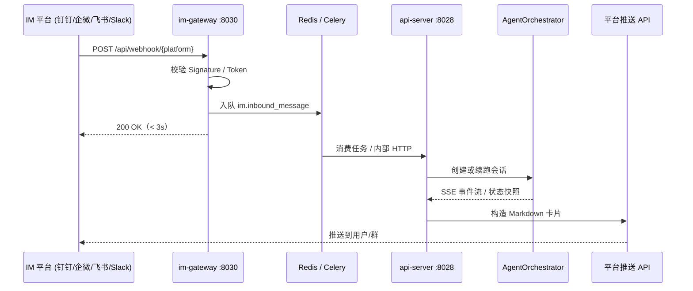

# IM 频道开发蓝图

> **版本**：v0.1（基建占位）  
> **状态**：前端 UI 占位 + `im-gateway` 独立容器已就绪；各平台正式接入待开发  
> **关联服务**：`services/im-gateway/`、`services/nginx/html`（IM 频道弹窗）、`gibh_agent/core/`（AgentOrchestrator）

---

## 1. 架构概述

### 1.1 业务目标

Omics Agent 当前以 Web 工作台为主入口。引入 **IM 频道** 后，科研人员可在手机端（钉钉 / 企业微信 / 飞书 / Slack）向同一智能体下发组学分析任务、查询进度、接收 Markdown 结果卡片，实现 **移动端远程遥控**。

### 1.2 为什么必须异步解耦

IM 平台对 Webhook 回调有 **严格超时**（通常 3–5 秒内必须返回 200）。而组学任务经 `AgentOrchestrator` 编排后可能运行数分钟至数小时，**绝不能在 Webhook 处理函数内同步等待 LLM / 工具链完成**。

因此采用与主 API 分离的 **`im-gateway` 微服务**，数据流如下：



**设计原则（与《架构开发宪法》对齐）**：

| 原则 | IM 场景落地 |
|------|-------------|
| TaaS / 重型算子隔离 | Webhook 线程只做验签 + 入队；算子仍走 Worker / launch-skills |
| 多模态资产总线 | 用户经 IM 上传的文件先入 `OmicsAssetManager`，再注入工作流 |
| 执行器反射注入 | IM 侧仅传递「自然语言 + 可选 session_id」；工具参数由编排器签名驱动 |
| 防爆装甲 | 网关统一返回 `{"status":"success"\|"error","message":"..."}` |

### 1.3 服务拓扑

```
                    ┌─────────────────┐
  公网 HTTPS ──────►│ nginx :80/8018  │──► 静态前端 + /api 反代
                    └────────┬────────┘
                             │
         ┌───────────────────┼───────────────────┐
         ▼                   ▼                   ▼
  ┌─────────────┐    ┌─────────────┐    ┌─────────────┐
  │ api-server  │    │ im-gateway  │    │ mcp-gateway │
  │   :8028     │◄───│   :8030     │    │   :8002     │
  └──────┬──────┘    └──────┬──────┘    └─────────────┘
         │                  │
         └────────┬─────────┘
                  ▼
           ┌─────────────┐
           │ redis:6379  │  ← Celery broker / 任务状态
           └─────────────┘
```

- **`im-gateway`**：仅持有各平台 SDK / 验签逻辑，暴露 `/api/webhook/*`；默认映射宿主机 **8030**。
- **`api-server`**：经内部 URL（`API_SERVER_INTERNAL_URL`）接收网关转发的「标准化入站消息」。
- **前端**：用户头像菜单 →「💬 IM 频道接入」→ 集成中心卡片（当前为 disabled 占位）。

---

## 2. 双向通信协议

### 2.1 接收端（Inbound Webhook）

各平台回调统一收敛到 `im-gateway` 的路由前缀 `/api/webhook/{platform}`。

#### 2.1.1 钉钉 DingTalk

1. 读取 Header：`timestamp`、`sign`（或新版开放平台签名头）。
2. 使用 `AppSecret` 计算 HMAC-SHA256，与 `sign` 比对。
3. 解析 JSON：`msgtype`、`text.content` / `content` 字段提取用户指令。
4. **3 秒内**返回 `{"msgtype":"empty"}` 或平台要求的 ack 结构。
5. 将 `{platform, user_id, chat_id, text, raw}` 写入 Redis 队列。

#### 2.1.2 企业微信 WeCom

1. GET 验证 URL 时：解密 `echostr`（EncodingAESKey + CorpID）。
2. POST 消息时：校验 `msg_signature`，解密 XML / JSON。
3. 提取 `FromUserName`、`Content`、`AgentID`。
4. 立即返回 `success` 字符串（企微要求纯文本）。

#### 2.1.3 飞书 Feishu

1. 校验 `X-Lark-Request-Timestamp` + `X-Lark-Signature`（SHA256 + App Secret）。
2. 处理 `url_verification` 挑战（返回 `challenge` 字段）。
3. 事件类型 `im.message.receive_v1` → 解析 `message.content`（JSON 字符串）。

#### 2.1.4 Slack

1. 校验 `X-Slack-Signature`（`v0:{timestamp}:{body}` + Signing Secret）。
2. 拒绝 replay（`|now - timestamp| > 5min`）。
3. `url_verification` → 返回 `challenge`。
4. `event_callback` → 提取 `event.text`、`event.user`、`event.channel`。

#### 2.1.5 标准化入站消息（网关 → api-server）

建议内部 POST `/api/im/inbound`（待实现）载荷：

```json
{
  "platform": "dingtalk",
  "external_user_id": "user_xxx",
  "external_chat_id": "chat_xxx",
  "text": "请对 uploads/sample.fastq 做质控",
  "session_id": null,
  "metadata": {}
}
```

### 2.2 发送端（Outbound Push）

编排器产生进度 / 结果后，由 **推送适配器** 调用各平台 Open API（不经 Webhook 原路返回）。

| 平台 | 推荐载体 | 要点 |
|------|----------|------|
| 钉钉 | 互动卡片 / Markdown | `access_token` 缓存 2h；单聊用 `oapi.dingtalk.com` 或新版 OpenAPI |
| 企业微信 | 模板卡片 `template_card` | `agentid` + `touser` / `toparty`；支持 markdown 字段 |
| 飞书 | 消息卡片 `interactive` | `receive_id` + `msg_type=interactive`；富文本用 lark_md |
| Slack | `chat.postMessage` | `blocks` 构建 Section + Markdown；线程回复带 `thread_ts` |

**推送内容建议映射 `state_snapshot` 四联**（与前端时光机一致）：

- `reasoning` → 折叠「思考过程」摘要（可选，默认不推全文）
- `text` → 主回复 Markdown
- `process_log` 最后一条 → 进度条文案
- `duration` → 任务耗时脚注

---

## 3. 安全性设计

### 3.1 Webhook 防恶意调用

| 措施 | 说明 |
|------|------|
| **平台签名校验** | 每个 `/api/webhook/*` 必须验签失败即 **401**，禁止「先 200 再说不」 |
| **共享密钥二次校验** | 可选环境变量 `IM_WEBHOOK_SHARED_SECRET`；内网转发时要求 Header `X-IM-Gateway-Secret` |
| **IP 允许列表** | 生产 nginx 层限制来源 IP 为各平台官方段（文档随平台更新） |
| **Replay 防护** | 校验 timestamp 窗口；Redis 记录 `message_id` 去重（TTL 24h） |
| **速率限制** | 按 `external_user_id` 令牌桶，防止刷接口拖垮 Celery |
| **最小权限密钥** | AppSecret / Bot Token 仅挂载到 `im-gateway` 容器，**不**进入 `api-server` 全量镜像 |

### 3.2 用户身份绑定

- IM 的 `external_user_id` 须与 Omics Agent `users` 表建立映射（首次扫码 / 输入绑定码）。
- 未绑定用户：仅允许只读帮助，**拒绝**触发带资产访问的编排任务。
- 绑定关系存 MySQL `im_channel_bindings`（表结构待迁移脚本）。

### 3.3 日志与脱敏

- 网关日志禁止打印完整 `AppSecret`、用户手机号、原始 FASTQ 路径中的患者标识。
- 审计日志记录：`platform`、`external_user_id` 哈希、`action`、`latency_ms`。

---

## 4. 环境变量清单

在 **`.env`**（已 gitignore）或 `docker-compose.override.yml` 中配置：

| 变量 | 服务 | 说明 |
|------|------|------|
| `DINGTALK_APP_KEY` | im-gateway | 钉钉应用 AppKey |
| `DINGTALK_APP_SECRET` | im-gateway | 钉钉 AppSecret（验签 + token） |
| `WECOM_CORP_ID` | im-gateway | 企业 ID |
| `WECOM_AGENT_SECRET` | im-gateway | 应用 Secret |
| `FEISHU_APP_ID` | im-gateway | 飞书应用 ID |
| `FEISHU_APP_SECRET` | im-gateway | 飞书应用密钥 |
| `SLACK_SIGNING_SECRET` | im-gateway | Slack 签名校验 |
| `SLACK_BOT_TOKEN` | im-gateway | `xoxb-` Bot Token（出站推送） |
| `IM_WEBHOOK_SHARED_SECRET` | im-gateway | 网关内部二次校验（可选） |
| `API_SERVER_INTERNAL_URL` | im-gateway | 默认 `http://api-server:8028` |
| `REDIS_URL` | im-gateway | 默认 `redis://redis:6379/0` |

公网回调 URL 示例（由运维在平台控制台填写）：

- 钉钉：`https://<your-domain>/im/webhook/dingtalk` → nginx 反代至 `im-gateway:8030`
- 企业微信 / 飞书 / Slack：同理，路径见 `main.py` 路由表

---

## 5. 下一步开发路线图

### Phase 1 — 网关硬化（当前基建已完成）

- [x] `im-gateway` Docker 服务 + `/ping` 健康检查
- [x] 前端「IM 频道接入」入口 + 四平台占位卡片
- [ ] nginx `location /im/` 反代至 `im-gateway:8030`
- [ ] 钉钉 `POST /api/webhook/dingtalk` 完整验签 + 入队

### Phase 2 — 消息管道

1. 定义 Celery 任务 `gibh_agent.tasks.im_process_inbound`。
2. `api-server` 新增 `/api/im/inbound`（仅允许内网 + 共享密钥）。
3. 复用 `AgentOrchestrator.run_stream` 或异步任务 API，关联 `session_id`。
4. Redis 存储 `im:reply:{task_id}` → 推送 worker 轮询或订阅。

### Phase 3 — 出站推送

1. 抽象 `ImPushAdapter` 接口：`send_markdown(chat_id, md)` / `send_card(...)`。
2. 实现钉钉、企微、飞书、Slack 四个 Adapter。
3. 订阅编排器 `done` / `message` SSE 事件，节流合并推送（避免刷屏）。

### Phase 4 — 前端配置闭环

1. 启用卡片「配置接入」按钮，跳转 OAuth 或展示 Webhook URL + 绑定码。
2. 调用 `GET /api/im/bindings` 展示已连接状态。
3. 管理员控制台增加 IM 频道审计页。

### Phase 5 — 验收

```bash
cd /home/ubuntu/GIBH-AGENT-V2
docker compose build im-gateway
docker compose up -d im-gateway
curl -s http://127.0.0.1:8030/ping
curl -s -X POST http://127.0.0.1:8030/api/webhook/dingtalk -H 'Content-Type: application/json' -d '{}'
```

浏览器：登录 → 头像菜单 →「💬 IM 频道接入」→ 确认四张卡片为灰色「敬请期待」。

---

## 6. 参考文件

| 路径 | 说明 |
|------|------|
| `services/im-gateway/main.py` | 网关 FastAPI 入口 |
| `services/im-gateway/Dockerfile` | 镜像构建 |
| `docker-compose.yml` → `im-gateway` | 编排与端口 8030 |
| `services/nginx/html/index.html` | `#im-channels-modal` 卡片网格 |
| `services/nginx/html/js/components/im_channels_modal.js` | 弹窗开关 |
| `docs/思考过程和历史快照.md` | 推送内容与 `state_snapshot` 对齐 |

---

## 7. 风险与约束

- **公网暴露**：Webhook 必须走 HTTPS；开发环境可用内网穿透，禁止将真实密钥写入 Git 跟踪文件。
- **长任务**：移动端需「任务已受理」即时回执 + 异步结果推送，避免用户重复发送。
- **多租户**：同一机器人服务多个实验室时，以 `tenant_id` 隔离绑定与资产目录。

---

*文档维护：IM 功能变更时请同步更新本章与 `docker-compose.yml` 环境变量注释。*
