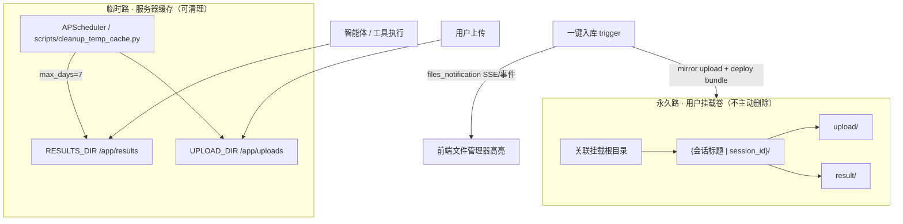

# 客户端文件系统

> 版本：2026-06-11 · 关联实现：`gibh_agent/core/storage/`、`gibh_agent/core/ingestion_deploy.py`、`services/nginx/html/js/components/workspace_action_bar.js`、`workspace_session_files.js`

---

## 1. 设计目标

| 痛点 | 方案 |
|------|------|
| 一键入库失败仅 Toast，无法反馈 | 后端返回 `traceback`；前端弹出可复制 Stack Trace 模态框 |
| 文件散落、无会话语义 | 挂载卷按 `{会话标题\|session_id}/upload\|result` 结构化落盘 |
| 运行时产物撑爆磁盘 | 双路存储：永久挂载 + `/app/results` 临时缓存（7 天清理） |
| 工作台看不到本会话文件 | 顶部手风琴「会话中的文件」，Deep Link 跳转文件管理器 |

---

## 2. 双路存储架构



### 2.1 临时路（第二路）

- **路径**：`RESULTS_DIR`（默认 `/app/results`）、`UPLOAD_DIR`（默认 `/app/uploads`）
- **用途**：工作流运行时输出、语料 `corpus_archive/`、HITL 中间态
- **生命周期**：`StorageManager.auto_cleanup(max_days=7)` — 由 api-server 启动时 APScheduler 每 12h 执行，或 `scripts/cleanup_temp_cache.py` 供 cron 手动触发
- **原则**：仅删「重型」且过期文件；`.csv/.md/.png/.json` 等轻量报告**永不删除**

### 2.2 永久路（第一路）

- **路径**：用户确认的 Docker 挂载卷（如 `/data/gibh_mount`）
- **结构**：

```text
[挂载根] / [会话 AI 标题（回退 session_id）] /
    upload/     # 用户上传资产（入库时从 UPLOAD_DIR 镜像）
    result/     # bundle_*.tar.gz + 解包目录（专家报告、语料 JSON、图表等）
```

- **命名**：`gibh_agent/core/storage/session_paths.resolve_session_folder_name()`
- **原则**：**永不主动删除**；用户自行在宿主机管理

---

## 3. 一键入库链路

1. **打包**（`data_packager.build_artifacts_archive`）：从临时缓存收集语料/报告 → `data/artifacts_archive/{owner}/{session}/bundle_*`
2. **落盘**（`ingestion_deploy.deploy_artifacts_to_mount`）：
   - 创建 `{mount}/{session_folder}/upload/` 与 `result/`
   - 镜像会话消息中的上传路径 → `upload/`
   - 复制 tar.gz + bundle 目录 → `result/`
3. **响应**：`files_notification` 含 `changed_paths`，前端派发 `omics:session-files-changed` → 文件树高亮

### 3.1 错误可观测性

API 异常时返回：

```json
{
  "status": "error",
  "message": "挂载路径不可用...",
  "error_type": "ValueError",
  "traceback": "Traceback (most recent call last): ..."
}
```

前端 `showIngestionErrorModal()` 用 `<pre><code>` 展示，并提供「一键复制报错信息」。

---

## 4. 前端交互

| 组件 | 文件 | 职责 |
|------|------|------|
| 入库操作栏 | `workspace_action_bar.js` | 触发入库、失败 Modal、成功刷新手风琴 |
| 会话文件手风琴 | `workspace_session_files.js` | 工作台顶部「会话中的文件」，upload/result 分区 |
| 文件管理 Deep Link | `index.html` `navigateFileManagerToPath` | 点击手风琴链接 → 展开右侧栏 → 定位高亮 |

### 4.1 API

- `GET /api/sessions/{session_id}/files` — 会话文件清单（临时 + 永久）
- `POST /api/ingestion/trigger` — 一键入库

---

## 5. 运维

| 动作 | 命令 |
|------|------|
| 手动清理临时缓存 | `cd /home/ubuntu/GIBH-AGENT-V2 && python3 scripts/cleanup_temp_cache.py --dry-run` |
| 禁用自动清理 | 环境变量 `STORAGE_CLEANUP_DISABLED=1` |
| 调整保留天数 | `STORAGE_CLEANUP_MAX_DAYS=7`（默认） |

---

## 6. 与既有文档关系

- I/O 全链路审计：[文件系统架构与I_O链路重构蓝图.md](./文件系统架构与I_O链路重构蓝图.md)
- 本地 Sidecar 预览闭环：[本地工作区与文件管理器闭环.md](./本地工作区与文件管理器闭环.md)
