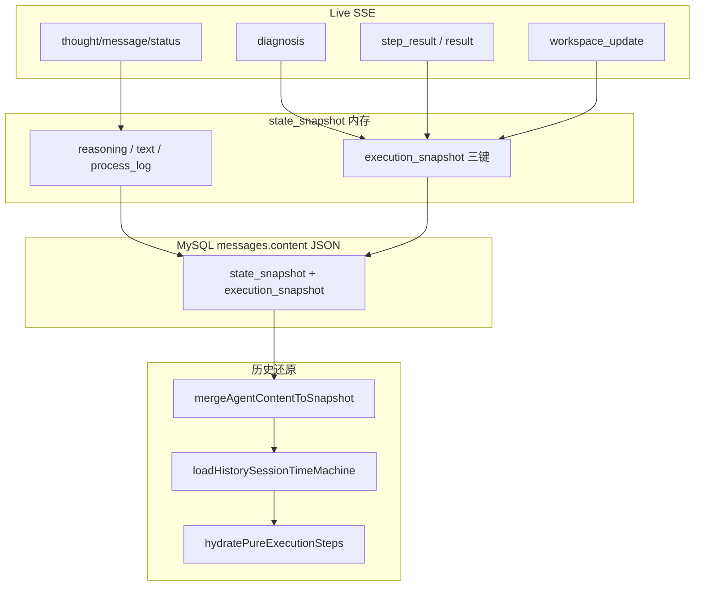

# 持久化层构建规范

> **适用范围**：Omics Agent 工作流执行「时光机」——从 Live 实时运行到 MySQL 入库，再到前端历史会话还原。  
> **核心原则**：**Live 产生什么，库就存什么；历史读什么，就用与 Live 同一套渲染引擎画什么**（1:1 状态镜面映射）。  
> **最后对齐**：`gibh_agent/core/execution_snapshot.py`、`gibh_agent/core/orchestrator.py`、`server.py`、`services/nginx/html/index.html`。

---

## 1. 设计目标与禁止事项

### 1.1 目标

| 目标 | 说明 |
|------|------|
| 全量镜像 | `steps_details` 与 Live 工作台步骤数组 **深拷贝 1:1 入库**，含数据诊断节点、管线步骤、图表、Markdown、日志等 |
| 三键解耦 | 诊断 HTML、专家 Markdown、执行步骤数组 **分字段存储**，互不覆盖 |
| 同源渲染 | 历史恢复 **禁止** 单独拼装手风琴/报告；必须走 `hydratePureExecutionSteps` → `renderExecutionSteps` |
| 槽位隔离 | 右栏三个固定 DOM 槽位，**只写各自 `innerHTML`**，禁止 `shell.innerHTML = ''` 砸盘子 |

### 1.2 禁止事项（长记忆）

- **禁止** `filterPurePipelineSteps` / `filter_pure_pipeline_steps` 等入库或还原前剔除「数据诊断」步骤的逻辑（已废弃）。
- **禁止** 为历史单独维护 `renderStaticSnapshotReport` 类特供拼装器。
- **禁止** 修改 `execution_snapshot` 三大法定键的语义（不得把诊断正文塞进 `steps_details` 唯一出口，也不得用 `steps_details` 顶替 `data_diagnosis_html`）。
- **禁止** 在已跟踪 Git 文件中写入真实内网 IP、明文密钥（见 `.cursor/rules/git-no-secrets-in-tracked-files.mdc`）。

---

## 2. 数据库与消息载体

### 2.1 表结构

**表名**：`messages`（`gibh_agent/db/models.py` → `Message`）

| 列 | 类型 | 说明 |
|----|------|------|
| `id` | Integer PK | 自增主键 |
| `session_id` | String(64) | 会话 UUID |
| `role` | String(32) | `user` / `agent` |
| `content` | **JSON** | 复杂嵌套结构，**无需**为时光机单独 ALTER 表 |
| `created_at` | DateTime | 创建时间 |

时光机数据写在 **agent 角色** 消息的 `content` 中。

### 2.2 `content` 顶层结构（入库形态）

由 `server._build_agent_message_content(state_snapshot_for_db)` 构造（`server.py`）：

```json
{
  "text": "助手正文 Markdown",
  "reasoning": "思考过程纯文本",
  "process_log": [{ "content": "...", "state": "running|completed|error" }],
  "tool_calls": [],
  "tool_output_memory": "",
  "state_snapshot": { /* 完整内存快照，见 §3 */ },
  "execution_snapshot": { /* 与 state_snapshot.execution_snapshot 同构，根级镜像便于查询 */ }
}
```

**说明**：

- 流式结束时会解析 SSE `event: state_snapshot`，整包写入 `content.state_snapshot`。
- 若快照内含 `execution_snapshot`，**同时**提升到 `content.execution_snapshot` 根级（G4 双写）。
- 入库前经 `sanitize_for_json` 清洗可序列化类型；`_start_time` 等运行时字段在入库前 `pop` 掉。

---

## 3. 内存快照 `state_snapshot`（编排器聚合）

在 `AgentOrchestrator` 单次对话流开始时初始化（`orchestrator.py`）：

```python
state_snapshot = {
    "text": "",
    "reasoning": "",
    "workflow": None,
    "steps": [],
    "process_log": [],
    "report": None,
    "duration": None,
    "_start_time": <unix>,  # 仅运行时，不入库
}
```

### 3.1 SSE → 快照字段映射（四联同步）

与前端 `createRestoreAIMessageRowWithSnapshot` / `handleServerEvent` 须保持一致（详见 `docs/思考过程和历史快照.md`）：

| SSE `event` | 写入 `state_snapshot` | 禁止 |
|-------------|----------------------|------|
| `thought` | `reasoning` | 不得写入 `text` |
| `message` | `text` | |
| `status`（非 `[AgenticLog]`） | `process_log[]` | |
| `done` | `duration` + 收口 `process_log` | |
| `workflow` / `plan` | `workflow` | |
| `diagnosis` | `report` + `update_diagnosis_in_state` → `execution_snapshot.data_diagnosis_html` | |
| `step_result` / `result` / `done` 中的 `report_data.steps_details` | `apply_execution_snapshot_to_state` | |
| `workspace_update`（markdown） | `update_expert_report_in_state` | |

---

## 4. 执行快照 `execution_snapshot`（三大法定键）

**模块**：`gibh_agent/core/execution_snapshot.py`  
**挂载位置**：`state_snapshot["execution_snapshot"]`，并镜像到 `messages.content.execution_snapshot`。

### 4.1 Schema（version 2）

```json
{
  "version": 2,
  "workflow_name": "可选工作流名称",
  "data_diagnosis_html": "数据诊断/校验富文本（Markdown 或 HTML 字符串）",
  "expert_report_markdown": "专家结题报告 Markdown",
  "steps_details": [ /* Live 全量步骤对象数组，1:1 深拷贝，禁止过滤 */ ],
  "report_data": {
    "workflow_name": "...",
    "steps_details": [ /* 与上同引用拷贝 */ ]
  }
}
```

| 键 | 类型 | 职责 |
|----|------|------|
| `data_diagnosis_html` | string | 仅诊断区富文本；由 `update_diagnosis_in_state` 维护 |
| `expert_report_markdown` | string | 仅专家结题 Markdown；由 `update_expert_report_in_state` / `workspace_update` 维护 |
| `steps_details` | array | **Live 完整步骤列表**；由 `apply_execution_snapshot_to_state` 写入 |

### 4.2 后端 API 一览

| 函数 | 作用 |
|------|------|
| `deep_copy_steps_details(steps)` | 深拷贝列表，**不做筛选** |
| `build_execution_snapshot(...)` | 组装 version 2 对象 |
| `_merge_execution_snapshot(state, ex)` | 写回 `execution_snapshot`、`steps`、`report.report_data.steps_details` |
| `update_diagnosis_in_state(state, diagnosis)` | 只更新 `data_diagnosis_html` |
| `update_expert_report_in_state(state, md)` | 只更新 `expert_report_markdown` |
| `apply_execution_snapshot_to_state(state, steps_details, ...)` | 用 Live 的 `steps_details` **全量覆盖**快照中的步骤，并保留已有诊断/专家字段 |
| `extract_steps_details_from_agent_content(content)` | 从已入库 JSON 反解析步骤（兼容根级 / `state_snapshot` 嵌套） |

### 4.3 编排器调用时机

- 工作流直接执行结束：`apply_execution_snapshot_to_state(state_snapshot, steps_details, workflow_name=...)`
- SSE `step_result`：`report_data.steps_details` 触发同上
- SSE `diagnosis`：`update_diagnosis_in_state`
- SSE `workspace_update`：`update_expert_report_in_state`
- SSE `result` / `done`：合并 `report_data` 后可能再次 `apply_execution_snapshot_to_state` / `update_expert_report_in_state`

---

## 5. 前端持久化与历史还原

### 5.1 从 DB 合并快照

`mergeAgentContentToSnapshot(content)`（`index.html`）：

- 以 `content.state_snapshot` 为底，根级 `text` / `reasoning` / `process_log` / `execution_snapshot` 等填空合并。
- 若根级存在 `execution_snapshot`，优先写入 `snap.execution_snapshot`，并将 `steps_details` 同步到 `snap.steps`（兼容旧数据）。

### 5.2 右栏三槽位 DOM（固定 ID，禁止砸壳）

由 `ensureOmicsReportThreeSlots(rootEl)` 保证存在：

| 顺序 | 元素 ID | 展示内容 |
|------|---------|----------|
| 1 | `#omics-data-diagnosis-slot` | 数据诊断报告 |
| 2 | `#omics-execution-details-slot` | 执行结果手风琴（Live 同源） |
| 3 | `#omics-expert-report-slot` | 专家分析报告（`bg-primary` 蓝头卡片） |

**DOM 顺序代码**（仅 `appendChild` 排序，不清空 `shell`）：

```javascript
shell.appendChild(diag);
shell.appendChild(exec);
shell.appendChild(expert);
```

### 5.3 历史时光机入口

```javascript
// 解析三键（不 filter steps）
var payload = resolveExecutionSnapshotMirror(snap);

// 镜面复原
loadHistorySessionTimeMachine(payload);
```

`loadHistorySessionTimeMachine` 行为摘要：

1. `renderExpertReportIntoSlot(slots.expert, payload.expert_report_markdown)` — 大厂蓝卡片头。
2. `renderDiagnosisIntoSlot(slots.diag, payload.data_diagnosis_html, payload)`。
3. `slots.exec.innerHTML = ''` 后 **`hydratePureExecutionSteps(slots.exec, payload.steps_details)`**（全量数组，禁止 filter）。

全局桥接：

```javascript
window.liveRenderEngine.hydrateExecutionSteps  // → hydratePureExecutionSteps → renderExecutionSteps
```

### 5.4 历史消息行还原链路

```
用户点击历史会话
  → 加载 messages
  → createRestoreAIMessageRowWithSnapshot(mergeAgentContentToSnapshot(content))
  → renderStaticHistorySnapshot(snap, cardZone, logZone)
       → 中栏 workflow 卡片 / process_log
       → loadHistorySessionTimeMachine(resolveExecutionSnapshotMirror(snap))  // 右栏
```

---

## 6. 端到端数据流（简图）



---

## 7. 变更自检清单（开发/Review）

在改动持久化或历史还原相关代码后，逐项确认：

- [ ] `execution_snapshot.py` 中 **无** 步骤过滤/伪步骤构造逻辑。
- [ ] `apply_execution_snapshot_to_state` 使用 `deep_copy_steps_details` 全量拷贝。
- [ ] `server._build_agent_message_content` 仍双写 `execution_snapshot`。
- [ ] 前端 **无** 新的历史特供报告拼装函数；历史走 `loadHistorySessionTimeMachine`。
- [ ] `renderExecutionSteps` / 历史入口 **未** 调用 `filterPurePipelineSteps`。
- [ ] 三槽位顺序：诊断 → 执行 → 专家；**未** `shell.innerHTML = ''`。
- [ ] 若改 SSE / `state_snapshot` 写入 / 入库 `content` / 历史 `mergeAgentContentToSnapshot` 之一，对照 `docs/思考过程和历史快照.md` 做四联同步。

---

## 8. 相关文件索引

| 路径 | 职责 |
|------|------|
| `gibh_agent/core/execution_snapshot.py` | 三键快照构造与合并 |
| `gibh_agent/core/orchestrator.py` | SSE 聚合、`state_snapshot`、调用 snapshot API |
| `gibh_agent/db/models.py` | `Message.content` JSON 列说明 |
| `server.py` | `_build_agent_message_content`、聊天流入库 |
| `services/nginx/html/index.html` | `ensureOmicsReportThreeSlots`、`resolveExecutionSnapshotMirror`、`loadHistorySessionTimeMachine`、`mergeAgentContentToSnapshot` |
| `docs/思考过程和历史快照.md` | 思考/正文/执行记录四联规范 |
| `.cursor/rules/gibh-architecture-constitution.mdc` | 架构宪法（含 state_snapshot 四联） |

---

## 9. 版本与兼容

- **当前快照版本**：`execution_snapshot.version === 2`
- **旧会话数据**：可能仅有 `state_snapshot.steps` 或 `report.report_data.steps_details`，前端 `extractStepsDetailsFromSnapshot` / `resolveExecutionSnapshotMirror` 按优先级回退读取。
- **旧版过滤数据**：在启用「全量镜像」之前入库的记录，可能缺少被旧 filter 剔除的诊断步骤；需重新执行工作流后快照才完整。

---

*文档维护：持久化层或时光机行为变更时，请同步更新本章与 `execution_snapshot.py` 模块 docstring。*
