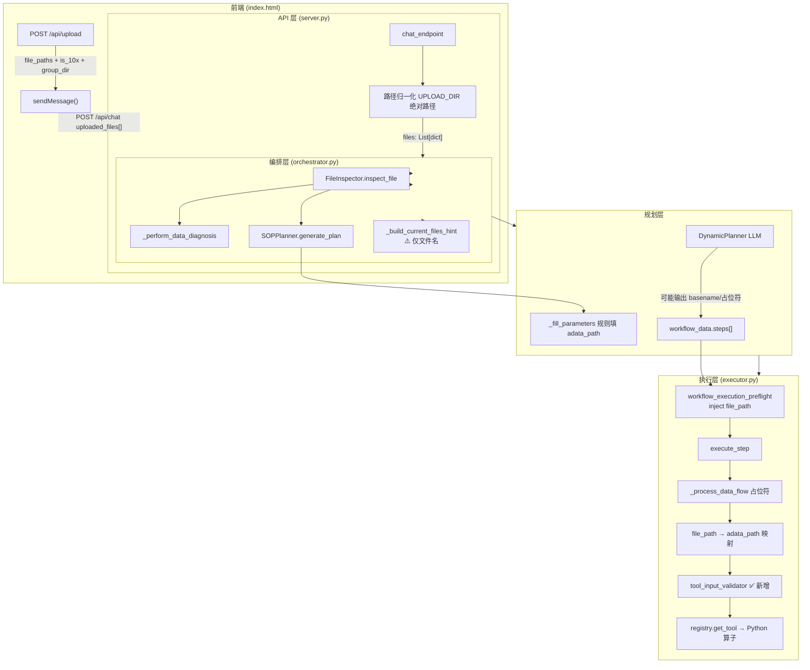

# 文件系统架构与 I/O 链路重构蓝图

> 版本：2026-06-09 · 审计范围：转录组 / 多模态组学上传 → 工具执行全链路 + 桌面本地轨  
> 关联实现：`gibh_agent/core/tool_input_validator.py`（第一阶段止血）  
> 本地挂载闭环详见：[本地工作区与文件管理器闭环.md](./本地工作区与文件管理器闭环.md)

---

## 1. 执行摘要

前端已能将 10x 三件套归档为带 `path` + `group_dir` + `is_10x` 的对象，但后端在 **LLM 上下文注入**、**Preflight 注入**、**参数名映射** 三处存在系统性断层，导致 `rna_data_validation` 等工具收到空 `adata_path` 或指向不存在的子文件路径。

**最核心缺陷（一句话）**：`AgentOrchestrator._build_current_files_hint()` 只向 LLM 注入**文件名**而非绝对路径，同时 Preflight 仅接受 `os.path.isfile()`，10x **目录**无法注入首步参数——LLM 与规则引擎均缺少可用的路径锚点。

---

## 2. 现状链路图



### 2.1 各阶段数据形态

| 阶段 | 关键字段 | 说明 |
|------|----------|------|
| 前端 payload | `path`, `file_path`, `is_10x`, `group_dir` | 10x 归档后 `group_dir` 为相对 uploads 的目录 |
| server.py 转换 | `{name, path}` (+ 本次修复保留 `is_10x`, `group_dir`) | 相对路径拼 `UPLOAD_DIR` |
| orchestrator 入口 | `{path, name, is_10x?, group_dir?}` | spread 保留扩展字段 |
| file_metadata | `file_path`, `real_data_path` | OmicsAssetManager 选 primary |
| workflow step.params | `file_path` / `adata_path` / 占位符 | Preflight 写 `file_path`；RNA 模板期望 `adata_path` |
| 工具签名 | `adata_path: str` | Pydantic schema 描述为「参数: adata_path」 |

---

## 3. uploaded_files 生命周期详解

### 3.1 接收（`server.py`）

- Schema：`ChatRequest.uploaded_files: List[dict]`
- SSE 路径遍历每条记录，提取 `file_name|name`、`file_path|path`
- 相对路径 → `UPLOAD_DIR / path`
- **历史问题**：丢弃 `is_10x` / `group_dir`（已在 2026-06-02 修复保留并 absolutize `group_dir`）

### 3.2 编排器归一化（`orchestrator.stream_process`）

```python
# gibh_agent/core/orchestrator.py ~811
for _f in files:
    _path = _f.get("path") or _f.get("file_path")
    # 相对 → 绝对
    _normalized.append({**_f, "path": _path, "name": ...})
```

### 3.3 注入 LLM 的上下文（断层 #1）

| 注入点 | 内容 | 是否含绝对路径 |
|--------|------|----------------|
| `_build_current_files_hint` | `[系统状态：当前工作台中已挂载文件：barcodes.tsv, ...]` | ❌ 仅 basename |
| `BaseAgent._detect_intent_with_llm` | `Uploaded Files: name1, name2` | ❌ |
| `DynamicPlanner._build_user_prompt` | `Available Files: foo.h5ad (path: /abs/...)` | ✅（规划模式） |
| `SkillAgent._llm_extract_args` | `【可用本地文件绝对路径】` 块 | ✅ |
| `IntentRouter` | `has_uploaded_files: bool` | ❌ |

**结论**：主工作流 Path A 在 SOP 生成后，LLM 参与的是**用户改表单 / DynamicPlanner 重规划**，此时多数路径 hint 不足；Skill 快车道反而设计正确。

### 3.4 规则填参 vs LLM 填参

| 模式 | 谁填 `adata_path` | 可靠性 |
|------|-------------------|--------|
| EXECUTION + SOPPlanner | `_fill_parameters` + `workflows/rna.py` 模板 | 高（有 file_metadata） |
| 用户点击「执行工作流」 | Preflight `inject_primary_file_path_into_workflow` | 中（曾仅 is_file） |
| LLM DynamicPlanner | LLM 输出 params | 低（basename / 占位符） |
| 次轮无 uploaded_files | `_resolve_inherited_upload_files` | 中（依赖 session 记忆） |

### 3.5 工具 Schema（`tool_registry.py`）

`@registry.register` 从函数签名自动生成 Pydantic 模型，字段 description 仅为 `参数: adata_path`，**未说明**：

- 可接受 10x 目录或 `.h5ad` 文件
- 应使用会话已上传的绝对路径
- 与同义键 `file_path` 的关系

LLM 通过 OpenAI tools 看到的 JSON Schema 同样缺少业务语义。

### 3.6 工具执行（`executor.execute_step`）

顺序：

1. 合并 `recommended_params`
2. 早期 `file_path → adata_path` 映射（反射）
3. Pydantic `model_validate`
4. `_process_data_flow` 占位符替换
5. scRNA-seq 类别再次映射 / 删除多余键
6. `_resolve_file_path` 多级回退
7. **`validate_and_normalize_inputs`（新增）**：上下文回退 + `os.path.exists`
8. `tool_func(**params)`

---

## 4. 断层根因分析

### R1 · LLM 路径上下文刻意弱化（Primary Root Cause）

`_build_current_files_hint` 设计为「状态提示」而非「可执行路径表」。当用户二次执行、表单 params 被清空占位符后，LLM 与 Preflight 都缺少**权威绝对路径源。

### R2 · 参数名分裂：`file_path` vs `adata_path`

- Preflight / 宪法默认写 `file_path`
- RNA 工具签名要 `adata_path`
- Executor 有多处映射，但在 **Pydantic validate 之前/之后** 时机不一，边缘场景仍漏映射

### R3 · Preflight 只认普通文件（10x 目录被误杀）

`resolve_primary_upload_path` 原逻辑 `rp.is_file()` → 10x 目录返回 `None` → `inject_primary_file_path_into_workflow` 返回 False → 前端报「无法在容器内定位上传文件」。

**已修复**：接受 `is_dir()`；首步同步写 `adata_path`。

### R4 · API 层丢弃 10x 元数据

`server.py` 重建 `file_dict` 时未保留 `is_10x` / `group_dir`，下游无法优先选择 10x 目录。

**已修复**。

### R5 · `_resolve_adata_path` 单路径不展开

`quality_control._resolve_adata_path` 仅在含 `,`/`;` 时调用 `resolve_omics_paths`；LLM 若填单个错误 `.tsv` 路径，不会自动纠正为父级 10x 目录。

### R6 · 前端执行时清空 path 占位符

`executeWorkflowFromForm` 故意清空 `<PENDING_UPLOAD>`，完全依赖后端注入链；任一环节失败即空参。

---

## 5. 故障模式对照（截图场景）

| 现象 | 根因组合 |
|------|----------|
| `Could not resolve path: .../matrix.mtx` | LLM/表单填了目录内单文件；未走 OmicsAssetManager 10x 目录 |
| 「无法在容器内定位上传文件」 | Preflight is_file 失败 + uploaded_files 未带可解析绝对路径 |
| 诊断识别 10x 但首步仍失败 | 诊断用 file_metadata；执行步 params 未同步 adata_path |
| Payload 正确但 tool_params 空 | 注入链在 Preflight/Executor 之前断裂 |

---

## 6. 第一阶段止血（已实施）

### 6.1 `tool_input_validator.py`

- `_collect_candidate_paths`：聚合 `uploaded_files`、`omics_resolved`、`file_metadata`
- `_pick_primary_path`：优先 10x 目录 → h5ad → 首个存在路径
- `_normalize_synonym_keys`：`file_path ↔ adata_path`
- `_validate_path_params_exist`：输入路径 `os.path.exists`，结构化错误 JSON

挂载点：

- `executor.execute_step`（主路径，带完整 step_context）
- `tool_registry` wrapper（ContextVar 兜底）

### 6.2 Preflight 加固

- 目录视为有效主路径
- 首步同时写 `adata_path`（若模板含该键）

### 6.3 API 元数据保留

- `server.py` chat 转换保留 `is_10x` / `group_dir`

---

## 7. 最终演进方案：隐式资源绑定（Implicit Resource Binding）

### 7.1 设计原则

> **LLM 只声明资源角色，系统绑定真实绝对路径。**

用户上传 → 会话级 `ResourceBundle`（不可变）→ 工具执行前由 **ResourceBinder** 解析，LLM 不直接填写绝对路径。

### 7.2 目标架构


### 7.3 ResourceBundle 结构（草案）

```python
@dataclass
class ResourceBundle:
    session_id: str
    primary_path: str          # OmicsAssetManager 选出的主路径
    assets: List[DataAsset]    # 分类后的多模态资产
    by_role: Dict[str, str]    # role -> absolute path
    # 例: {"scrna_matrix": "/app/uploads/.../10x_data_xxx", "scrna_h5ad": "..."}
```

### 7.4 参数绑定规则表（草案）

| 工具参数 | 绑定角色 | 回退顺序 |
|----------|----------|----------|
| `adata_path` | `scrna_matrix` | 10x_mtx → h5ad → file_path |
| `fastqs_path` | `fastq_dir` | uploads 下 fastq 目录 |
| `file_path` | `primary` | bundle.primary_path |
| `data_path` | `primary` 或逗号拼接多表 | tables[] |

### 7.5 LLM Prompt 改造（Phase 2）

- `_build_current_files_hint` 改为 **Resource Summary**：
  ```
  [系统资源：scrna_matrix=/app/uploads/.../10x_data_xxx (10x, 2866 cells预估); 请勿编造路径，执行时由系统自动绑定]
  ```
- OpenAI tools schema 增加 `x-resource-role: scrna_matrix` 扩展字段（或移除 path 由 binder 注入）

### 7.6 实施路线图

| 阶段 | 内容 | 状态 |
|------|------|------|
| P0 | `tool_input_validator` + Preflight 目录 + API 元数据 | ✅ 2026-06-02 |
| P1 | `ResourceBundle` 在 orchestrator 构建，写入 `step_context` | 待做 |
| P2 | `ResourceBinder` 替代分散的 file_path/adata_path 映射 | 待做 |
| P3 | LLM prompt / schema 只暴露角色不暴露路径 | 待做 |
| P4 | 前端 execution payload 携带 `resource_bundle_id` | 待做 |

---

## 8. 关键文件索引

| 职责 | 路径 |
|------|------|
| Chat API | `server.py` |
| 流式编排 | `gibh_agent/core/orchestrator.py` |
| SOP 规划 | `gibh_agent/core/planner.py` |
| RNA 工作流模板 | `gibh_agent/core/workflows/rna.py` |
| 执行前注入 | `gibh_agent/core/workflow_execution_preflight.py` |
| 工具执行 | `gibh_agent/core/executor.py` |
| **输入安检门** | `gibh_agent/core/tool_input_validator.py` |
| 工具注册 | `gibh_agent/core/tool_registry.py` |
| 组学路径分桶 | `gibh_agent/core/path_resolvers.py` |
| 资产总线 | `gibh_agent/core/omics_asset_manager.py` |
| RNA 校验工具 | `gibh_agent/tools/rna/quality_control.py` |
| 前端 payload | `services/nginx/html/index.html` |

---

## 9. 验收建议

1. 上传 10x 三件套 → 执行转录组标准工作流 → 首步 `rna_data_validation` params 含有效 `adata_path`（目录）
2. 次轮不带 `uploaded_files` 仅点执行 → 继承 session 路径仍能绑定
3. 故意填错路径 → 返回 `error_category: input_path_not_found`，前端展示「无法在容器内定位上传文件…」
4. 单元测试：`pytest tests/test_tool_input_validator.py -q`

---

## 10. 事故复盘：Errno 21 Is a directory（2026-06-02）

### 10.1 控制台现象

```
[Errno 21] Unable to synchronously open file
filename = '/app/uploads/.../10x_data_20260602_152126'
error message = 'Is a directory'
```

从「双联体检测」起后续步骤（HVG、Scale、PCA、Neighbors、UMAP、Leiden、Marker、注释）全部失败。

### 10.2 根因链（三层叠加）

| # | 层级 | 问题 |
|---|------|------|
| 1 | **工作流模板** `workflows/rna.py` | 非 FASTQ 场景下，**所有** scRNA 步骤 `adata_path = file_path`（10x 目录），未使用 `<previous_step_output>` |
| 2 | **链式传递** `executor.py` | `_backfill_ann_data_path_params` 仅在参数**为空**时注入；已填 10x 目录时不覆盖；`rna_data_validation` 把 `output_h5ad` 设为目录，污染 `current_file_path` |
| 3 | **工具层** `analysis.py` / `quality_control.py` | 多数步骤直接 `sc.read_h5ad(adata_path)`，对目录抛 Errno 21 |

P0 止血（路径存在性）解决了「找不到文件」，但**误把目录当作 h5ad** 打开是独立的第二阶段问题。

### 10.3 已实施修复（P0.5）

1. **`load_adata_from_path`**（`quality_control.py`）：目录内优先读 `filtered.h5ad` 等中间产物，否则 `read_10x_data`
2. **`rna_data_validation`**：输入为 10x 目录时**不再**返回 `output_h5ad`（避免链式污染）
3. **`_extract_ann_data_path_from_tool_result`**：只提取真实 `.h5ad` 文件路径
4. **`executor._backfill_ann_data_path_params`**：若 `adata_path` 为上传 10x 目录且前序有 h5ad，**强制替换**
5. **占位符 `<previous_step_output>`** 解析
6. **RNA 模板**：仅 `rna_data_validation` / `rna_qc_filter` 绑定原始上传路径，其余步骤用 `<previous_step_output>`
7. **`tool_input_validator`**：下游工具优先 `current_file_path` 链式 h5ad

### 10.4 预期行为（修复后）


### 10.5 仍待 P1

- `ResourceBundle` 统一绑定，消除模板/Executor/Validator 三处重复逻辑
- 所有 scRNA 工具写回 `output_h5ad` 到独立 `results/` 目录，避免污染 uploads

---

## 11. 持久化资产 / 熔断 / UI 脏数据（2026-06-02 二轮）

### 11.1 持久化资产 vs 新上传

| 来源 | 问题 | 修复 |
|------|------|------|
| 数据资产 `asset_id` + 过期 `file_path` | DB 路径与磁盘不一致 | `asset_locator.resolve_asset_path`：DB 查 asset_id → 容器规则解析 → basename rglob |
| 相对路径 `owner/batch/file` | 仅拼 session 目录 | `resolve_upload_path_for_container` + `UPLOAD_DIR/rel` |
| 前端未传 `asset_id` | 无法 DB 回查 | `addAssetAsAttachment(..., assetId)` |

入口：`server.py` `normalize_uploaded_files_list`；执行前：`orchestrator` `strict=True`。

### 11.2 严格 DAG 熔断

`executor._should_halt_workflow_on_error`：路径类错误（`input_path_not_found`、`No such file`、Errno 2/21）**强制** `break`；仅 `can_skip=True` 且非致命错误可继续。

路径安检门返回 `can_skip: False`。

### 11.3 Base64 脏输出折叠

- 前端 `foldDirtyContentInMarkdownSource` → `safeMarkedParse` 前置
- 影像工具 `nifti_preview.py` 输出 `<details class="omics-dirty-accordion">`
- 指标卡 `_skillVisRenderValueHtml` 长 Base64/长文本折叠

### 11.4 桌面本地轨与文件管理器（2026-06-09）

| 能力 | 实现要点 |
|------|----------|
| 挂载路径可点击 | 全局委托 `.mount-path-card` / `.linked-directory` → `navigateFileManagerToPath()` |
| 本地图片预览 | Sidecar `GET /api/files/download`；树节点 `dataset.source=local` |
| CORS | Sidecar `allow_credentials=False` + 兜底中间件（勿用 `credentials=True` + `origins=*`） |
| 云结果目录 | `/app/results/...` → 文件管理 Tab 高亮，非 Sidecar 列目录 |

完整 SOP 与验收：[本地工作区与文件管理器闭环.md](./本地工作区与文件管理器闭环.md)

