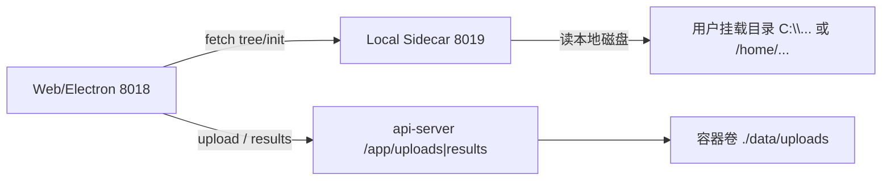

# 本地工作区与文件管理器闭环

> **版本**：2026-06-09 · 已验收经验沉淀  
> **关联实现**：`services/nginx/html/index.html`、`gibh-desktop-app/local_sidecar/local_server.py`、`services/nginx/html/js/components/workspace_action_bar.js`

---

## 1. 目标

打通三条用户路径，形成可点击、可预览、可跳转的闭环：

| 场景 | 用户动作 | 预期 |
|------|----------|------|
| 任意界面 | 点击挂载路径卡片（`.mount-path-card`） | 展开右侧栏 → 本地项目 Tab → 树展开到该目录 |
| 文件管理器 | 双击挂载目录下图片 | 模态框在线预览（不经云端） |
| 工作台 | 点击「结果存放目录」（`.linked-directory`） | 同上，导航到对应目录或云资产 Tab |

---

## 2. 架构：双轨 I/O



| 轨道 | 端口 | 典型路径 | 预览 URL |
|------|------|----------|----------|
| **本地 Sidecar** | `127.0.0.1:8019` | `C:\Users\...\rawdata\results\*.png` | `GET /api/files/download?path=<encodeURIComponent(绝对路径)>` |
| **云端静态** | 与页面同源 8018 | `/app/results/run_*/...` | `GET /api/files/download?path=...`（经 `getCloudUploadBaseUrl()`） |

**成功经验**：本地树节点必须设置 `row.dataset.source = 'local'`，且预览来源用 `resolveFilePreviewSourceForPath()` 推断；Windows 绝对路径（`C:\...`）**禁止**默认走 cloud。

---

## 3. 前端核心 API（`index.html`）

### 3.1 全局委托

`bindGlobalMountPathNavigation()` 在 `window.onload` 注册，监听：

- `.mount-path-card` — 右侧栏工作区路径、入库确认路径等  
- `.linked-directory` — 工作台「结果存放目录」、工作流 `output_dir` 只读链接  

点击调用 `navigateFileManagerToPath(path, { mode })`：

| `inferPathNavigationMode(path)` | 行为 |
|----------------------------------|------|
| `local` | `setRightSidebarMode('local')` → `fetchAndRenderWorkspaceTree()` → `expandWorkspaceTreeToPath()` |
| `hpc` | 超算 Tab + `enterHpcDirectory()` |
| `cloud` | 文件管理 Tab + `fetchAndRenderFilesPanel()` + 前缀高亮 |

### 3.2 图片预览

| 函数 | 职责 |
|------|------|
| `resolveFilePreviewSourceForPath(path, rowSource)` | 统一 local / cloud / hpc |
| `filePreviewDownloadUrl(path, source)` | 本地 → `localSidecarUrl('/api/files/download?path=...')` |
| `renderPreviewImage()` | **本地优先**：`` 直连；失败再 blob |
| `isImagePreviewExtension(ext)` | png/jpg/gif/webp/svg/bmp/tiff/avif/heic 等 |

双击 `#file-tree-container` 内 `.file-tree-file` 触发 `previewAssetFile()`。

### 3.3 工作台结果目录

- SSE `result` / `step_result` 写入 `window.__lastWorkflowReportMeta.output_dir`  
- `renderExecutionSteps()` 末尾调用 `renderLinkedDirectoryHtml(outputDir, '结果存放目录')`  
- `extractWorkflowOutputDir()` 从 report 或步骤 params 兜底解析  

---

## 4. Local Sidecar CORS（根治预览失败）

### 4.1 根因（已踩坑）

原配置：

```python
allow_origins=["*"],
allow_credentials=True,  # 与 * 互斥
```

浏览器规范禁止 `Access-Control-Allow-Credentials: true` 与 `Access-Control-Allow-Origin: *` 并存；Starlette **不写 ACAO 头**，控制台报：

`No 'Access-Control-Allow-Origin' header is present`

`/api/workspace/tree` 偶发成功，是因为简单 GET 不触发预检；`/api/files/download` 的 fetch/blob 必失败。

### 4.2 修复（`local_server.py`）

```python
app.add_middleware(
    CORSMiddleware,
    allow_origins=_SIDECAR_CORS_EXPLICIT_ORIGINS,  # 8018/8019 等
    allow_origin_regex=r"https?://.*",
    allow_credentials=False,
    allow_methods=["*"],
    allow_headers=["*"],
    expose_headers=["Content-Disposition", "Content-Length", "Content-Type"],
)

@app.middleware("http")
async def sidecar_cors_fallback_middleware(...):
    # OPTIONS 204 + 所有响应（含 FileResponse、HTTPException）补 ACAO
```

**成功经验**：

1. Sidecar 本地服务**不需要** Cookie，`allow_credentials=False`  
2. 兜底中间件保证 `FileResponse` 与 400 错误也带 CORS  
3. 前端 Sidecar 请求**不要**带 `Authorization`（`fetchFilePreviewBlobUrl` 已对 127.0.0.1 跳过鉴权头）

### 4.3 Sidecar 下载接口

`GET /api/files/download?path=<绝对路径>` — 图片 MIME 已覆盖 png/jpeg/gif/webp/svg/bmp/tiff/avif 等（见 `local_server.py` 内 `media` 映射）。

---

## 5. 运维与验收

### 5.1 重启 Sidecar（必做，代码变更后）

**Electron 桌面端（Windows）：**

1. 完全退出 Omics Agent（任务管理器确认无 `local_sidecar.exe`）  
2. 开发态：`cd gibh-desktop-app\local_sidecar && python local_server.py`  
3. 安装包：重新 `build_sidecar` 后再启动客户端  

**仅 Web 静态变更：**

```bash
cd /home/ubuntu/GIBH-AGENT-V2
docker compose -f docker-compose.yml restart nginx
# 浏览器 Ctrl+Shift+R
```

### 5.2 CORS 自检（Sidecar 已启动的机器上）

老版本 `curl` 可能不支持 `-X OPTIONS`，用 Python：

```bash
python3 - <<'PY'
import urllib.request
req = urllib.request.Request(
    "http://127.0.0.1:8019/health",
    headers={"Origin": "http://127.0.0.1:8018"},
)
with urllib.request.urlopen(req, timeout=3) as r:
    print("ACAO:", r.headers.get("Access-Control-Allow-Origin"))
PY
```

期望：`ACAO: http://127.0.0.1:8018`

### 5.3 功能验收清单

- [ ] 左下/右侧挂载路径卡片可点击，右侧树展开到对应目录  
- [ ] 双击 `results/*.png` 弹出预览，无「暂不支持该格式」Toast  
- [ ] 工作台执行完成后「结果存放目录」可点击跳转  
- [ ] 控制台无 CORS 报错  

### 5.4 相关文件索引

| 职责 | 路径 |
|------|------|
| 前端导航/预览 | `services/nginx/html/index.html` |
| 样式 | `services/nginx/html/css/main.css`（`.mount-path-card`、`.linked-directory`） |
| 入库路径卡片 | `services/nginx/html/js/components/workspace_action_bar.js` |
| Sidecar 服务 | `gibh-desktop-app/local_sidecar/local_server.py` |
| Electron 拉起 Sidecar | `gibh-desktop-app/main.js` |

---

## 6. 与云端 I/O 蓝图的关系

容器内 `/app/uploads`、`/app/results` 仍走 **api-server** 下载接口；本地 Windows 盘符路径走 **Sidecar**。详见 [文件系统架构与 I/O 链路重构蓝图](./文件系统架构与I_O链路重构蓝图.md) §11。
