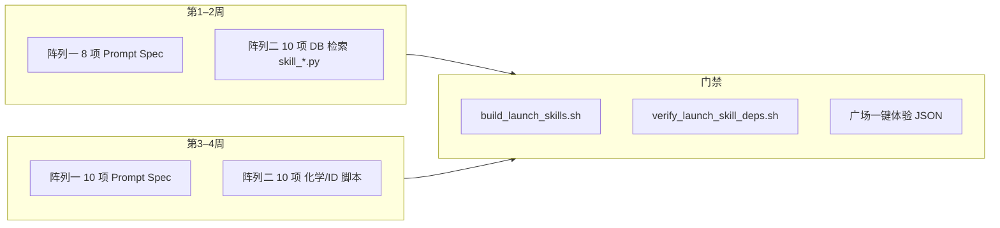

# 第一阶段：轻量级技能批量突击清单

> **角色视角**：首席产品规划师 & 技能生态架构师  
> **数据源**：`docs/生物信息分析工具.csv`（磐石储备，**675 行 / 653 个唯一技能名**）  
> **系统能力锚点**：`gibh_agent/skills/_prompt_skill_*`（LLM 结构化输出）+ `services/launch-skills`（秒级 Python/HTTP 脚本）+ 广场 `markdown` / Metrics Board / Mermaid / iframe 渲染  
> **战线原则**：暂缓本地大文件、目录监听、GPU 结构预测、组学全流程 DAG、重型 WebGL 双向交互

---

## 1. 筛选结论（Executive Summary）

| 维度 | 数量 | 说明 |
|------|------|------|
| 候选总量 | 675 | `skills类型`：脚本 644、模型 18、数据库调用 13 |
| **建议纳入第一阶段** | **~120–180**（批量模板化） | 阵列二占主体；阵列一需**新增**软技能（CSV 几乎无「零代码」行） |
| **明确暂缓（Phase 2+）** | **~450+** | 组学流水线、AF/ESM/对接/MD、peak calling、大矩阵统计、交互式 3D 等 |
| **已落地可对齐** | **18** Prompt 软技能（阵列一核心清单已全部接入）+ **15** Launch 硬技能 | 见 `prompt_soft_skill_templates.py`、`launch_skill_demos.py` |

**关键判断**：CSV 以「公开数据库 HTTP 检索 / 标识符交叉引用」为主（`子分类=数据分析` 占 613 条），与阵列二高度重合；**阵列一不能从 CSV 直接勾选**，须按生信/药研**工作流缺口**从 675 条的业务语境**反推** Prompt 技能（对标已有 PPT 大纲、思维导图、周报等）。

---

## 2. 分类规则与排除红线

### 2.1 纳入标准

| 阵列 | 技术门槛 | 交付形态 | 耗时预期 |
|------|----------|----------|----------|
| **阵列一 · 纯 Prompt** | 无 `ToolRegistry`、无 outbound HTTP（用户粘贴材料即可） | 强制 JSON / Markdown / Mermaid；复用全屏 Markdown、思维导图、PPT 分页卡片 | 秒级 |
| **阵列二 · 单脚本云端** | 单文件 `<120` 行 Python/R；`requests` / `chembl_webresource_client` / `BioPython` / `RDKit` 轻调用 | `status` + `markdown` + 小表 / 指标卡 / 可选 `json_url` | 秒级–分钟级 |

### 2.2 排除红线（本清单绝不列入）

- 读取/扫描**本地数十 GB** 组学矩阵、BAM/FASTQ 目录、HPC 挂载盘  
- **监听本地目录**、长时 Worker 队列、Conda 巨型环境（BepiPred / AlphaFold / LAMMPS / CP2K 等）  
- **重型 WebGL / py3Dmol 双向交互**、分子动力学、蛋白结构预测、DiffDock 类对接  
- **多步 Omics DAG**（如 CSV 中的「转录组学标准全流程」「差异标志物发现」）  
- **模型类** 18 条（`skills类型=模型`：AlphaFold2、ESM3、Evo2、ESMFold、BioGPT 等）

---

## 3. 阵列一：纯 Prompt 驱动类（Zero-Code / Prompt-Engineered）

> **说明**：下列技能名称为**第一阶段建议新增**的广场条目（非 CSV 原名列）；业务域与 675 条储备一致。实现路径：`gibh_agent/skills/prompt_specs/<id>/SKILL.md` + `PROMPT_SOFT_SKILL_TEMPLATES` + Pydantic schema（参考 `skill_ppt_outline.py` / `skill_mindmap_gen.py`）。

### 3.1 核心清单（18 项 · 高业务价值）

| # | 技能名称 | 核心价值（一句话） | 期望前端渲染 |
|---|----------|-------------------|--------------|
| 1 | **差异表达结果解读助手** | 将用户粘贴的 DEG 表（gene/log2FC/padj）转为生物学叙事、关键基因点评与后续验证建议 | Markdown 报告 + 可选表格摘要 |
| 2 | **GO/KEGG 富集结果叙事生成** | 基于富集表（Term、pvalue、GeneRatio）生成「机制—疾病—文献方向」连贯解读，不编造未给出的统计量 | Markdown 分节 + 引用占位 |
| 3 | **单细胞实验设计检查清单** | 从研究问题出发输出 scRNA-seq 样本量、批次、双胞、参考面板、质控阈值等可勾选 Checklist | Markdown Checklist |
| 4 | **变异临床意义解读草案（ACMG 风格）** | 根据用户提供的变异位点、基因、人群频率文字描述，生成证据条目草稿（须标注「需数据库核实」） | Markdown 表格 + 警示条 |
| 5 | **生物信息 Pipeline 选型备忘录** | 对「RNA-seq / WGS / 蛋白组」等目标对比 2–3 套工具链优缺点与适用场景（**不执行**计算） | Markdown 对比表 |
| 6 | **组学样本 Metadata 规范审查** | 审查用户粘贴的样本表（SampleID、Group、Batch、RIN 等），输出缺失字段与混杂风险 | Markdown 问题清单 + 表格 |
| 7 | **引物/qPCR 实验设计说明** | 生成引物设计原则、对照设置、扩增子长度建议（序列由用户另提供或走阵列二） | Markdown + 参数表 |
| 8 | **期刊 Cover Letter 草稿** | 根据题目、亮点、目标期刊风格生成投稿信（中英可选） | Markdown |
| 9 | **审稿意见 Rebuttal 要点提纲** | 将审稿意见逐条映射为回复策略、补充实验优先级 | Markdown 编号列表 |
| 10 | **会议口头报告讲稿大纲** | 将论文结构转为 10–15 分钟口述提纲（过渡句、时间分配） | JSON 分页大纲（同 PPT 大纲组件） |
| 11 | **临床注册方案骨架生成（CONSORT 导向）** | 输出试验标题、目的、入排标准、主要/次要终点、统计假设框架 | Markdown 结构化骨架 |
| 12 | **药物重定位假说备忘录** | 基于用户文字描述的疾病—靶点—药物，生成可验证假设与文献检索关键词（不调用 OpenTargets） | Markdown |
| 13 | **蛋白质功能假说推演** | 从结构域/修饰/定位等**用户给定注释**推演功能与实验验证路线 | Markdown + Mermaid 小图 |
| 14 | **实验失败复盘报告** | 将失败现象、可能原因、对照实验建议整理为组会可用复盘稿 | Markdown |
| 15 | **文献矩阵精读笔记** | 将 3–10 篇摘要粘贴转为对比维度表（方法、样本、结论、局限） | Markdown 宽表 |
| 16 | **多组学整合分析故事线** | 帮助撰写「基因组→转录组→蛋白组」逻辑链条与图表编排建议（无真实数据运算） | Markdown + Mermaid 流程 |
| 17 | **伦理与知情同意要点清单** | 按干预类型输出伦理审查常见问答与知情同意书章节提醒 | Markdown Checklist |
| 18 | **统计方法选择建议书** | 根据设计类型（两组/配对/生存/重复测量）推荐检验与前提假设说明 | Markdown 决策树 |

### 3.2 与现有系统技能的对照（避免重复建设）

| 已有种子技能 | 关系 |
|--------------|------|
| 科研汇报 PPT 大纲生成 | 阵列一 #10 可复用 `ppt_outline` schema，差异化「口述 vs 幻灯片」 |
| 分析逻辑思维导图生成 | 阵列一 #16 可复用 `mindmap_gen` |
| 工程蓝图制图 | 阵列一 #5 Pipeline 选型可输出简化版 HTML 蓝图 |
| 学术摘要精炼 / 深度调研 | 阵列一 #15 与之互补（矩阵 vs 单篇） |

### 3.3 批量投产建议（阵列一）

- **模板工厂**：`prompt_specs/` 目录 + `run_prompt_spec_skill()` 统一入口（见 `skill_blueprint_drafter.py`）  
- **一周冲刺节奏**：每天 3–4 个 spec + 种子 `PROMPT_SOFT_SKILL_SEEDS` + `patch_launch_skills_batch` 的 Prompt 同类脚本  
- **验收**：无 outbound 网络；输出 schema 经 `tests/test_prompt_soft_skills_smoke.py`（建议新增）校验 JSON 字段

---

## 4. 阵列二：单脚本云端驱动类（Lightweight Cloud Scripts）

> **说明**：下列名称**对齐 CSV**（`docs/生物信息分析工具.csv`），优先选择已有 `tool_chain_key`、公开 REST、或 **RDKit/BLAST 轻量** 模式；实现路径：`gibh_agent/skills/skill_*.py` → `launch-skills` 容器（§5.11.1）。

### 4.1 核心清单（20 项 · 高业务价值）

| # | 技能名称（CSV 原名） | 核心价值（一句话） | 期望前端渲染 | 实现要点 |
|---|---------------------|-------------------|--------------|----------|
| 1 | **PubMed数据库查询** | 按关键词快速拉取文献题录与摘要片段，支撑立题与写作 | 表格 + Markdown 摘要列表 | E-utilities / `biopython` Entrez；`tool_chain_key=pubmed` |
| 2 | **UniProt数据库查询** | 查蛋白功能注释、亚细胞定位、交叉引用 | 表格 + 指标卡（长度、基因名） | REST；已有同类可对齐 `uniprot` |
| 3 | **ClinVar 数据库查询** | 查变异临床意义与提交记录 | 表格 + 状态徽章 | ClinVar API |
| 4 | **dbSNP 数据库查询** | 查 SNP 位点、等位基因频率概览 | 表格 | NCBI SNP API |
| 5 | **GWAS catalog 数据库查询** | 查性状—SNP 关联与发表引用 | 表格 | GWAS Catalog REST |
| 6 | **Reactome 数据库查询** | 查通路层级与参与分子 | Markdown 层级 + 表格 | Reactome API |
| 7 | **InterPro 数据库查询** | 查蛋白结构域与功能分类 | 表格 | InterPro REST |
| 8 | **GEO 数据库查询** | 查表达数据集 accession 与实验设计摘要 | 表格 + 外链 | NCBI GEO |
| 9 | **基因蛋白信息查询器** | 按基因名聚合多物种蛋白注释 | 指标卡 + 表格 | 多库聚合或 Ensembl REST |
| 10 | **获取mRNA序列工具** | 按基因名取 mRNA 序列（FASTA 文本） | 代码块 + 下载链接 | Entrez / Ensembl；`mrna` |
| 11 | **ChEMBL药物检索** | 按药名/状态查 ChEMBL 药物记录 | 表格 | `chembl_webresource_client`；**已部分落地** |
| 12 | **分子格式转换工具** | SMILES/Mol/InChI/SDF 互转与标准化 | 文本对 + 指标卡 | RDKit；`rdkitTransform`；**已部分落地** |
| 13 | **检索相似小分子** | Tanimoto 相似化合物推荐 | 表格 + 相似度指标 | ChEMBL similarity API |
| 14 | **通过SMILES获取CID** | SMILES → PubChem CID | 指标卡 + 表格 | PubChem PUG REST；**已部分落地** |
| 15 | **药物标识符交叉检索** | DrugBank/ChEMBL/PubChem/KEGG 等 ID 互证 | 宽表 | 多源 HTTP 聚合 |
| 16 | **代谢物名称检索** | RefMet 标准化代谢物名与分子式 | 表格 | RefMet API |
| 17 | **RNAcentral 按编号查询** | RNA 家族条目与交叉 ID | 表格 | `rnacentral` REST |
| 18 | **Ensembl GO术语后代查询** | 扩展 GO 查询到子术语 | 树形 Markdown / 表格 | Ensembl Ontology API；`ensemblGo` |
| 19 | **OpenTargets_按ChEMBL ID获取父分子和子分子** | 药物—分子层级关系 | 表格 | Open Targets GraphQL |
| 20 | **FDA药品标签字段检索** | 按标签字段检索 FDA 药品说明章节 | 表格 + Markdown 节选 | openFDA；`fda` |

### 4.2 阵列二 · 第二批批量模板（同一技术档，略举 10 项）

以下与上表**同档**，适合「一个 `skill_*.py` + 一份 `launch_skill_demos` 默认值」流水线复制：

- **PharmGKB获取基因详细信息** → 指标卡 + 表格  
- **4DN文件元数据查询** → 元数据表格（**仅 JSON 元数据，不下载大矩阵**）  
- **依据ChEMBL ID查询药物作用机制** → Markdown 机制摘要 + 表格  
- **化合物检索**（多库 InChIKey/SMILES）→ 宽表  
- **子结构搜索** / **相似性搜索化合物**（PubChem）→ CID 列表表  
- **Ensembl本体术语获取工具** → 术语定义 Markdown  
- **检索相关文献**（泛生物医学）→ 同 PubMed 组件  
- **核酸序列两两比对** / **蛋白质序列两两比对** → 比对统计指标卡 + 文本（**launch-skills 已落地 BLAST 轻量版**）  
- **分子量计算工具** / **分子 BBB 评估工具** → Metrics Board（化学 `chem_*` 可复用模式）  
- **BioStudies研究详情查询** → 实验元数据表  

### 4.3 阵列二 · 明确剔除的 CSV 同名项（勿进第一阶段）

| CSV 技能名 | 剔除原因 |
|-----------|----------|
| 3D分子结构渲染工具 / 三维分子结构可视化 / 二维分子结构可视化 | 重型 WebGL / 交互 3D |
| CP2K / LAMMPS | 分子动力学 / 量子化学 |
| AlphaFold2 / ESMFold / DiffDock / Evo2 / ESM3 | GPU 模型推理 |
| 转录组学标准全流程 / 差异标志物发现 | 多步 Omics DAG + 大文件 |
| GTEx自定义eQTL动态计算 | 计算量大、易超时 |
| GDC文件列表 / ENCODE数据文件列表 | 易导向 GB 级下载 |
| ChIPAtlas富集分析 | 需 peak 矩阵与统计引擎 |
| RNA二级结构可视化工具 | 非轻量可视化 |

---

## 5. 两阵列产能与优先级（建议排期）

| 优先级 | 阵列 | 理由 |
|--------|------|------|
| P0 | 阵列二 #1–8（PubMed/UniProt/ClinVar/dbSNP/GWAS/Reactome/InterPro/GEO） | 查询频率最高、无文件依赖、demo 参数稳定 |
| P0 | 阵列二 #11–14（ChEMBL/格式转换/相似分子/SMILES→CID） | 与已落地 10 项 Launch 技能同构，复制成本最低 |
| P1 | 阵列一 #1–6（组学结果解读 + 实验设计） | 补足 CSV 空白区，提升「无数据也能用」留存 |
| P1 | 阵列一 #8–12（写作/临床） | 通用科研写作场景，Prompt 模板可共享 |
| P2 | 阵列二 OpenTargets/FDA/PharmGKB 等 | API 字段复杂，需更多错误处理 |

---

## 6. 工程落点速查（给研发 / AI 助手）

| 阵列 | 代码落点 | 数据落点 |
|------|----------|----------|
| 一 | `gibh_agent/skills/skill_<id>.py` 或纯 `prompt_specs/` | `gibh_agent/db/prompt_soft_skill_templates.py` |
| 二 | `gibh_agent/skills/skill_<id>.py` + `launch_skill_demos.py` | `gibh_agent/db/seed_skills.py` + `scripts/patch_launch_skills_batch.py` |
| 二（依赖） | `services/launch-skills/Dockerfile` + `requirements.txt` | `LAUNCH_SKILLS_BASE_URL` 委托 api-server |

**宪法提醒**：工具层路径参数仅用 `file_path` / `sequence_or_path` / `smiles_text` 等词汇表；返回体 `@safe_tool_execution` + `markdown` / `image_urls`。

---

## 7. 暂缓队列（Phase 2+）摘要

- **模型 18 条** + **组学 DAG** + **影像/空间组学** + **peak calling / 富集计算引擎**  
- **交互式分子 3D** + **MD/QM** + **HPC 目录型工具**  
- 待阵列一/二模板稳定后，以 **TaaS Worker** 或 **Omics DAG** 单独立项，不纳入本清单。

---

## 8. 文档维护

- CSV 变更后重跑：`PYTHONPATH=. python3 scripts/update_bioinformatics_tools_csv_impl_status.py`（刷新最右列「实现情况」）  
- 种子技能索引刷新：`PYTHONPATH=. python3 scripts/export_skill_library_md.py`  
- 阵列一 Batch2 入库：`PYTHONPATH=. python3 scripts/sync_phase1_array1_batch2_to_db.py`
- 本清单版本：**v1.1 · 2026-06-01**（阵列一 18/18 已接入）
