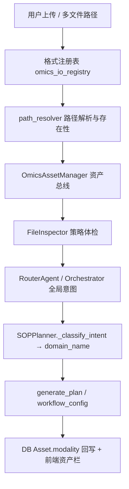

# 组学分析 Task 构建规范文档（SOP 工作流全链路 SOP）

> **受众**：负责将「科学分析流程」落地为可执行 Task 的研发、AI 编程助手与架构维护者。  
> **目标**：你只需提供 **① 该模态下有序的全流程 `step_id` 列表** 与 **② 每步绑定的 `tool_id`（`@registry.register(name=...)`）及关键默认参数键**，再按本规范落位代码与联调点位，即可在本仓库内构造 **与现有四模态（代谢组 / RNA / 空间转录组 / 影像组学）同级** 的可诊断、可路由、可执行的组学分析 Task。  
> **前提**：遵守 `.cursor/rules/gibh-architecture-constitution.mdc`（路径参数词汇表、`@safe_tool_execution`、重型算子隔离）；重型 CPU/GPU 须在 Worker/TaaS 或子进程中执行。

**仓库内四模态权威参考实现（成功案例）**


| 域名 `domain_name`（`WorkflowRegistry` 键） | 实现文件                                              | 编排目标 Agent           |
| -------------------------------------- | ------------------------------------------------- | -------------------- |
| `Metabolomics`                         | `gibh_agent/core/workflows/metabolomics.py`       | `metabolomics_agent` |
| `RNA`                                  | `gibh_agent/core/workflows/rna.py`                | `rna_agent`          |
| `Spatial`                              | `gibh_agent/core/workflows/spatial_workflow.py`   | `spatial_agent`      |
| `Radiomics`                            | `gibh_agent/core/workflows/radiomics_workflow.py` | `radiomics_agent`    |


**扩展说明**：`STED_EC` / `SPATIOTEMPORAL_DYNAMICS` 为单细胞轨迹专项通道，定义于 `gibh_agent/core/workflows/sted_ec_workflow.py`，路由仍走 `rna_agent`。细胞类型探针、缺失时自动标注与报告 Obs 表折叠规则见 **[`STED_EC_细胞类型探针与报告展示规范.md`](./STED_EC_细胞类型探针与报告展示规范.md)**。本文以 **四模态 tabular/spatial/imaging 标准管线** 为主模板。

**三大组学扩展（基因组已贯通，可作新模态模板）**

| 域名 `domain_name` | 实现文件 | Runner / 工具 |
| --- | --- | --- |
| `genomics` | `gibh_agent/core/workflows/genomics_workflow.py`（12 步） | `omics_genomics_pipeline_tools.py` + `omics_genomics_runner.py` |
| `epigenomics` | `epigenomics_workflow.py` | `omics_epigenomics_runner.py` |
| `proteomics` | `proteomics_workflow.py` | `omics_proteomics_runner.py`（及 pipeline_tools） |

用户侧标准测试文件（`test_data/`，可用 `scripts/download_omics_test_data.py` 拉取）：`genomics/sample1_R1.fastq.gz`、`proteomics/BSA1_F1.mzML`、`epigenomics/SRR1822153_1.fastq.gz`。

**七大多模态分类**：上传文件如何归到转录组 / 空间 / 代谢 / 影像 / 基因组 / 表观 / 蛋白七域，见 **§2.5**（资产总线 `OmicsAssetManager` → 体检 → 路由 → Planner → 资产库回写）。

---

## 摘要 · 一步到位融合路线图（步骤清单 + 工具名 → 可跑 Task）

> **输入**：你交付的「制品」最小集  
>
> - **有序步骤表**：`step_id`（DAG 节点名，全工作流唯一）、人类可读 `name`/`description`、对应 `**tool_id`**（已与工具注册一致）、每步 `**default_params` 的键**（用于前端 `param_{索引}_{Key}` 与诊断白名单）。  
> - **依赖关系**：对每个 `step_id` 给出 **直接依赖**（父节点列表），由实现方填入 `get_steps_dag()`。

> **输出**：编排器可生成 `workflow_config`、Executor 可按步调用 `ToolRegistry`、`capabilities_digest` 可出现该域 SOP、诊断可产出合法参数推荐。

### A. 你必须先对齐的概念（避免 step_id / tool_id 混用）


| 概念            | 含义                                                     | 约束                                                                                                      |
| ------------- | ------------------------------------------------------ | ------------------------------------------------------------------------------------------------------- |
| `**step_id`** | DAG 与前端步骤卡片逻辑 ID                                       | 在同一 `domain_name` 工作流内唯一；建议前缀区分模态（如 `rna_`、`spatial_`），与 Planner 意图分类中的 **Available Steps** 字符串一致。      |
| `**tool_id`** | `gibh_agent/tools/` 内 `@registry.register(name="...")` | **仅允许字母数字下划线**；必须与 `get_step_metadata(step_id)["tool_id"]` **逐字一致**，否则 Executor `registry.get_tool` 失败。 |
| **一步多工具**     | 同一 `tool_id` 被多个 `step_id` 使用                          | 允许（如空间 `spatial_plot_scatter` 用于 `plot_clusters` 与 `plot_genes`）；依赖与占位符通过 **不同 `step_id`** 区分。          |


### B. 代码与数据落点（推荐勾选顺序）


| 顺序  | 交付物                          | 路径或说明                                                                                                                                                                                                                                   |
| --- | ---------------------------- | --------------------------------------------------------------------------------------------------------------------------------------------------------------------------------------------------------------------------------------- |
| 1   | 底层原子工具（若尚未存在）                | `gibh_agent/tools/<模块>.py`：`@registry.register` + `@safe_tool_execution`；路径参数名仅用宪法词汇表（`file_path`、`data_path`、`input_dir`、`matrix_dir`、`image_path`、`mask_path`、`adata_path` 等）。                                                        |
| 2   | 确保工具被加载                      | `gibh_agent/tools/__init__.py` 的 `load_all_tools()` 可发现该模块；必要时参考化学侧「侧车 import」模式，避免运行时注册表缺工具。                                                                                                                                           |
| 3   | **工作流 DAG + 元数据**            | 新建或扩展 `gibh_agent/core/workflows/<your_workflow>.py`，继承 `BaseWorkflow`，实现 `get_name` / `get_description` / `get_steps_dag` / `get_step_metadata`。                                                                                       |
| 4   | **注册到 WorkflowRegistry**     | `gibh_agent/core/workflows/registry.py` 的 `_auto_register()`：`import` 你的类并 `self.register(...)`。                                                                                                                                        |
| 5   | **生成模板 `generate_template`** | 默认继承 `BaseWorkflow.generate_template` 即可；若覆写（强参考 `**RNAWorkflow`、`SpatialWorkflow`、`RadiomicsWorkflow**`），必须仍返回 `type: workflow_config`，且 `**workflow_data` 内含 `domain_name: self.get_name()**`（编排器 Reporting / 资产分类依赖，见 `base.py` 注释）。 |
| 6   | **Planner 意图分类同步**           | `gibh_agent/core/planner.py` 中 `_classify_intent` 的 **system_prompt**：**Available Domains**、**Available Steps (YourDomain)** 与你的 DAG **一致**（否则 LLM 会吐出无效 `target_steps`）。上传文件的 **域名** 还依赖 **§2.5 多模态分类链路**（资产总线 → 体检 → 路由规则）。 |
| 7   | **编排器 Agent 绑定**             | `gibh_agent/core/orchestrator.py`：根据 `domain_name` 选择 `metabolomics_agent` / `rna_agent` / `spatial_agent` / `radiomics_agent`（或扩展新 specialist）。                                                                                        |
| 8   | **前端步骤展示名（可选但强烈推荐）**         | `services/nginx/html/index.html` 内 `window.STEP_NAME_MAP`：`step_id` 或关键 `tool_id` → 中文进度文案；与 `planner.py` 中 `_get_step_display_name` 的 `name_mapping` **对齐**，避免直播/右栏显示原始 snake_case。                                                    |
| 9   | **冒烟或集成验证**                  | `PYTHONPATH=. python -c "from gibh_agent.core.tool_registry import registry; assert registry.get_tool('你的tool_id')"`；再跑一条「规划 → 执行」链路或现有 pytest。                                                                                         |


### C. 上线前三叉验证（必跑）

```bash
cd /home/ubuntu/GIBH-AGENT-V2
# 1) 工具已注册（将 «tool_id» 换成真实 ID）
PYTHONPATH=. python -c "from gibh_agent.tools import load_all_tools; load_all_tools(); from gibh_agent.core.tool_registry import registry; t = registry.get_tool('«tool_id»'); assert t is not None, 'missing tool'; print('ok', '«tool_id»')"

# 2) 工作流可被注册表解析（将 «domain_name» 换成 Metabolomics / RNA / Spatial / Radiomics 等）
PYTHONPATH=. python -c "from gibh_agent.core.workflows.registry import registry as wr; w = wr.get_workflow('«domain_name»'); assert w is not None; print(list(w.get_steps_dag().keys()))"

# 3) capabilities_digest：SOP 来自 WorkflowRegistry.list_workflows()，注册成功后重启 API 即可进入语义路由/澄清视野；一般无需改 digest 源码。
```

---

## 1. 工作流契约：`BaseWorkflow` 四类接口

文件：`gibh_agent/core/workflows/base.py`。

### 1.1 `get_name() -> str`

- 返回 **域名**，与 `WorkflowRegistry` 中键 **完全一致**（大小写敏感），例如 `"Metabolomics"`、`"RNA"`、`"Spatial"`、`"Radiomics"`。
- 编排器用该字符串选择 specialist 与 `get_workflow(domain_name)`。

### 1.2 `get_steps_dag() -> Dict[str, List[str]]`

- 键：`**step_id`**；值：该步骤 **直接依赖** 的 `step_id` 列表（无前驱则为 `[]`）。
- **必须是 DAG**（无环）。执行顺序由 `resolve_dependencies()` 做拓扑排序得到。
- **传递依赖可不展开**：只需列出直接父节点；但若 Executor 占位符解析依赖「明确父 step」，请在设计 DAG 时保证父节点会先执行。

**四模态 DAG 形态摘要（便于你对照抄结构）**

- **代谢组**：前置校验 → 检查 → 预处理 → 下游分叉（PCA / PLS-DA / 模型对比）→ 差异 → 火山图 / 通路。
- **RNA**：可选 FASTQ 分支（`rna_cellranger_count` → `rna_convert_cellranger_to_h5ad`）；主干 QC → 标准化 → HVG → scale → PCA → neighbors → UMAP/聚类 → … → 注释。
- **空间**：`load_data` → 校验 / QC / PCA / 聚类 / 多分辨率对比 → `spatial_neighbors` → Moran's I → 通路 → 可视化分叉。
- **影像组学**：校验 → `load_image` → `preprocess` → `preview_slice` 与 `extract_features` 分叉后汇合建模 → Rad-Score → 可视化。

### 1.3 `get_step_metadata(step_id) -> dict`

每个 `step_id` 必须返回：

```text
{
  "name": "步骤展示名",
  "description": "给 Planner/LLM/用户看的说明",
  "tool_id": "与 ToolRegistry 注册名一致",
  "default_params": { ... }   # 建议非空对象：至少包含该工具签名中出现的路径/核心键，供诊断白名单采集
}
```

- `**default_params` 的键** 即前端表单 `name="param_{i}_{Key}"` 中的 `**Key`**；诊断 LLM 表格第一列必须与之一致（见 `gibh_agent/core/diagnosis_param_whitelist.py`）。
- 未知 `step_id` 建议 `**raise ValueError`**（与代谢组一致），避免静默 `{}` 导致后续空白步骤。

### 1.4 `generate_template(...) -> dict`

标准返回结构（覆写时勿破坏字段语义）：

```text
{
  "type": "workflow_config",
  "workflow_data": {
    "workflow_name": "...",
    "name": "...",
    "domain_name": "<与 get_name() 一致>",
    "steps": [ { "id", "step_id", "tool_id", "name", "step_name", "description", "selected", "params" }, ... ]
  },
  "file_paths": [ ... ],
  "template_mode": <可选，布尔：无上传时为 True 表示仅预览>
}
```

- `**params` 占位符**：常用 `<PENDING_UPLOAD>`、`<步骤step_id>`、`<output_dir>/xxx`；Executor 在 `_process_data_flow` 中解析（见 `gibh_agent/core/executor.py`）。
- **覆写 `generate_template` 时**：RNA/Spatial/Radiomics 已示范如何按文件类型（FASTQ / H5AD / 目录）改写步骤列表与参数注入；新模态请沿用同一模式。

---

## 2. 工具层：`tool_id` 与反射执行

文件：`gibh_agent/core/executor.py` · `WorkflowExecutor.execute_step`。

### 2.1 注册与命名

- 工具函数：`@registry.register(name="<tool_id>", description="...", category="...")`。
- **Executor 仅用 `tool_id` 取函数**，与 `step_id` 无自动映射关系。

### 2.2 参数过滤与类型强制

- `_filter_and_coerce_params_to_signature` 按 **Python 函数签名** 过滤参数：只有在工具函数声明中出现的形参才会传入；多余键丢弃，减少幻觉参数导致的 `TypeError`。

### 2.3 步骤间数据流（占位符）

- 字符串形如 `<some_step_id>` 或业务占位（如 `<preprocess_data_output>`）会在执行期替换为 **前序步骤工具返回值中解析出的路径**。
- **新增占位符类型** 若无法匹配现有分支，可能需在 `executor.py` 的数据流处理中扩展（搜索 `_process_data_flow` 与 `placeholder`）。

**实践建议**：优先使用 `**step_id` 作为占位符名**（与 `SpatialWorkflow` 中 `h5ad_path: "<qc_norm>"` 一类对齐），降低 Executor 特例分支数量。

### 2.4 三大组学链式产物（基因组贯通要点）

文件：`gibh_agent/core/executor.py` · `WorkflowExecutor` 对 `tool_category in ("Genomics", "Epigenomics", "Proteomics")` 的分支。

| 要点 | 说明 |
| --- | --- |
| **产物类型传递** | 每步成功后按 `vcf_path` → `filtered_vcf_path` → `annotated_vcf_path` → `bam_path` → `trimmed_fastq` 优先级更新 `current_file_path`，避免 CNV/SV 写入的 `bam_path` 盖住胚系 VCF 导致 VQSR 收到 `.cnn` 等非 VCF。 |
| **CNV/SV 需 BAM** | `genomics_cnv_calling` / `genomics_sv_calling`：若 `params.bam_path` 为空，从 `step_results` 倒序注入 `bam_path` / `dedup_bam_path`。 |
| **临床报告聚合** | `genomics_clinical_reporting` 通过 `_serialize_prior_qc_metrics()` 注入 `pipeline_metrics_json`（含 `qc_metrics`、`variant_summary`、`sv_count`、`acmg_proxy_counts`、各步 VCF 路径）。 |
| **工具层参数** | CNV/SV 工具签名除 `file_path` 外增加 `bam_path`（宪法词汇表内）；Planner 填参仍以 `file_path` 为主。 |

---

## 2.5 多模态文件分类：七域路由全链路

> **与 Task 的关系**：工作流 `domain_name` 并非凭空推断——用户上传的文件会经 **资产总线 → 体检 → 全局路由 → Planner 域名分类 → 资产库回写** 逐层收敛到七大多模态组学之一（或 Chat/专项通道）。新增模态时，除 §1–§2 的 DAG/工具外，还须同步本节所列嗅探与路由落点，否则易出现「广场卡片对了、上传即拒 / 域名串台 / 资产栏仍显示未分类」。

### 2.5.1 七域定义与前端对齐

用户数据资产栏与编排器回写使用同一套 **modality 键**（见 `services/nginx/html/index.html` 中 `FIXED_MODALITY_KEYS` / `FIXED_MODALITY_LABELS`）：

| modality 键 | 中文标签 | 典型 `WorkflowRegistry` 域名 |
| --- | --- | --- |
| `rna` | 转录组学 | `RNA`（路由别名 `transcriptomics` / `single_cell` 均归并写 `rna`） |
| `spatial` | 空间组学 | `Spatial` |
| `metabolomics` | 代谢组学 | `Metabolomics` |
| `radiomics` | 医学影像组学 | `Radiomics` |
| `genomics` | 基因组学 | `genomics` |
| `epigenomics` | 表观遗传组学 | `epigenomics` |
| `proteomics` | 蛋白质组学 | `proteomics` |
| `uncategorized` | 其他文件 | 尚未完成规划或未命中嗅探规则 |

**专项通道（非七域 tab，但影响域名）**：`STED_EC` / `SPATIOTEMPORAL_DYNAMICS` 仍走 `rna_agent`，资产栏可写 `sted_ec`；技能快车道 `[Omics_Route: genomics|proteomics|epigenomics]` 直接锁定三大组学 Agent。

### 2.5.2 分层架构（上传 → 可执行 Task）



**设计原则（架构宪法）**：

- **多文件不拼逗号串进工具**：`parse_multiple_files` / `OmicsAssetManager.classify_assets` 产出 `DataAsset` 列表，Executor 经 `to_legacy_resolved_dict` 对齐旧桶语义。
- **捆绑优先**：同一会话内 10x 三件套 → `10x_bundle`；Visium 矩阵 + `spatial/` → `spatial_bundle`；影像 + 掩膜 → `radiomics_pair`。
- **文件格式优先于 LLM 臆测**：Planner 提示词明确「Visium → Spatial、NIfTI → Radiomics、mzML → proteomics」等硬规则（见 §3.1 与 `planner.py` CRITICAL ROUTING RULES）。

### 2.5.3 第一层：格式注册表与路径门禁

| 模块 | 文件 | 职责 |
| --- | --- | --- |
| 扩展名字典 | `gibh_agent/core/omics_io_registry.py` | `OMICS_COMPOUND_EXTENSIONS` / `OMICS_SIMPLE_EXTENSIONS` 统一维护 `.fastq.gz`、`.nii.gz`、`.mzml` 等；**新增模态后缀须在此登记**（§10.2 体检闸口同源）。 |
| 格式校验 | `gibh_agent/utils/path_resolver.py` · `validate_inspector_file_format` | 仅解析后缀、不读盘；未知后缀**不阻断**，改由 `get_inspector_format_warning` 写入 warning。 |
| 远程占位 | `infer_loose_file_type_from_path_string` | Local/HPC 挂载无法在容器内 stat 时，按路径推断 `fastq` / `proteomics_ms` / `tabular` / `radiomics` 等，供 Planner 与诊断路由。 |

### 2.5.4 第二层：OmicsAssetManager（多模态资产总线）

文件：`gibh_agent/core/asset_manager.py`。

**输入**：规范化 `List[str]` 路径（可选 `lineage_group_ids` 隔离多批次上传）。

**分类阶梯**（单血缘组内，`_classify_lineage_group`）：

1. **10x 三件套** → `10x_bundle`（`matrix.mtx` + `barcodes.tsv` + `features.tsv`/`genes.tsv`）
2. **空间 Visium** → `spatial_bundle`（矩阵 `.h5` 或 10x_mtx 目录 + 含 `spatial/` 或 tissue_positions 等标记的目录）
3. **影像组学** → `radiomics_pair` / `radiomics_image` / `radiomics_mask`（按文件名 mask/roi/seg 启发式配对）
4. **表格** → `metabolomics_csv`（`.csv`/`.tsv`/`.xlsx`/`.txt`）
5. **AnnData** → `h5ad_single`
6. **10x HDF5 矩阵** → `10x_h5_matrix`（如 `filtered_feature_bc_matrix.h5`）
7. **蛋白 FASTA** → `protein_fasta`
8. **后缀映射** → `protein_structure` / `document` / `plain_text` / `generic_unknown`（`_DYNAMIC_ASSET_SUFFIXES_BY_TYPE`）

**路由辅助字段**（并入 `file_metadata` 供 LLM 读取）：

- `routing_asset_types`：去重后的 `asset_type` 列表
- `routing_asset_inventory`：`[{asset_type, file_name, primary_path}, …]`
- `routing_asset_digest`：人类可读摘要

**工作流原生 vs 非工作流资产**（全局 Chat/Task 分流）：

- `ROUTING_WORKFLOW_NATIVE_ASSET_TYPES`：`10x_bundle`、`spatial_bundle`、`h5ad_single`、`metabolomics_csv`、`radiomics_*` 等 → 倾向 **task** 模式
- `ROUTING_NON_WORKFLOW_ASSET_TYPES`：`protein_structure`、`document`、`plain_text` 等 + 模糊分析请求 → 倾向 **chat**（PyMOL 等技能工具）

编排器在 `_merge_routing_asset_fields` 与 `_classify_global_intent` 中调用；**Task 作者扩展新原生资产类型时须同步更新上述两个 frozenset**。

### 2.5.5 第三层：FileInspector 深度体检

文件：`gibh_agent/core/file_inspector.py`（策略模式 + `SpatialVisiumHandler` 等）。

| 阶段 | 行为 |
| --- | --- |
| 路径自愈 | `asset_locator.bridge_data_asset_to_physical_path` + `heal_web_path_if_missing`（basename 模糊匹配） |
| Handler 链 | 按优先级 `can_handle` → `inspect`；Visium 目录返回 `file_type="visium"`、`domain="Spatial"` |
| 医学影像旁路 | `.nii`/`.dcm` 禁止走表格 pandas 逻辑，直接 `build_medical_imaging_inspection_result` |
| **组学回退** | 无专用 Handler 时，`.fastq`/`.mzml`/`.bam`/`.vcf` 等仍 **路径级 success**（`file_type=fastq|proteomics_ms|alignment|variants`），避免误报「无法识别」（§10.2 第 3 项） |
| 多文件解析 | `parse_multiple_files` 将逗号拼接路径拆入 `images`/`masks`/`matrix`/`barcodes`/`features`/`tables`/`unknown` 桶 |

`file_metadata` 中的 `file_type` / `domain` 是 Planner **CRITICAL ROUTING RULES** 的硬输入之一。

### 2.5.6 第四层：RouterAgent 与编排器快车道

| 机制 | 文件 | 规则摘要 |
| --- | --- | --- |
| `[Omics_Route: …]` | `router_agent.py` · `_quick_route` | 技能模板注入标签 → 直接 `genomics`/`proteomics`/`epigenomics` + 对应 Agent |
| 扩展名快车道 | 同上 | `.h5ad`/`.mtx`/`.fastq` → 转录组；`.csv` → 代谢组；同批 RNA+CSV 冲突时 **以最后上传文件** 为准 |
| 查询关键词 | 同上 | 空间 / 影像 / 代谢 / STED_EC / 时空动力学关键词优先于泛化转录组 |
| 全局 Chat vs Task | `orchestrator.py` · `_classify_global_intent` | 结合 `OmicsAssetManager` 嗅探 + 模糊查询（「帮我分析」）决定是否进工作流 DAG |

### 2.5.7 第五层：Planner 域名分类（`domain_name`）

文件：`gibh_agent/core/planner.py` · `_classify_intent`。

LLM 在 system_prompt 列出九域（含 `STED_EC` / `SPATIOTEMPORAL_DYNAMICS`）；user_prompt 注入 **File Metadata + routing_asset_digest**，并附 **优先级**：

```text
文件格式（visium→Spatial, medical_image→Radiomics, mzML→proteomics）
  > routing_asset_types / routing_asset_inventory
  > 用户查询关键词
  > LLM 自由推断
```

**典型歧义消解**（Task 联调时常见）：

| 上传形态 | 用户意图线索 | 应落域名 |
| --- | --- | --- |
| `.fastq` | 单细胞 / Cell Ranger | `RNA` |
| `.fastq` | WGS/WES/GATK/BWA/变异 | `genomics` |
| `.fastq` | ATAC/ChIP/MACS2/peak | `epigenomics` |
| `.h5ad` / 10x | visium / 空间转录组 | `Spatial` |
| `.h5ad` | 时空动力学硬核词 | `SPATIOTEMPORAL_DYNAMICS` |
| `.h5ad` | moscot / 轨迹 | `STED_EC` |
| `.csv` | 无 RNA 明示 | `Metabolomics` |
| `.mzml` / `.raw` | — | `proteomics` |
| `.pdb` / 文档 | 无组学流程明示 | 全局路由 → **chat**；勿强行 RNA/Spatial |

`generate_template` 必须在 `workflow_data.domain_name` 写入与 `get_name()` 一致的域名（§1.4、§4.1），供 Executor 与报告资产分类使用。

### 2.5.8 第六层：规划完成后资产 modality 回写

文件：`gibh_agent/core/orchestrator.py`（Path A 规划成功分支）。

- 根据最终 `domain_name` 映射 `workflow_type`（如 `Metabolomics`→`metabolomics`，`RNA`/`transcriptomics`→`rna`）
- 对 DB 中 **同 owner、modality 为空、file_name 命中本轮上传** 的 `Asset` 行批量更新
- 与 `user_data.py` · `_infer_modality_from_file_name`（按文件名轻量推断）及 `POST /api/assets/reclassify` 互补：后者处理历史未分类资产，前者保证 **本轮规划与会话资产栏即时一致**

### 2.5.9 新模态扩展检查清单（分类侧）

| # | 检查项 |
| --- | --- |
| 1 | `omics_io_registry.py` 登记新后缀；§10.2 体检闸口可放行 |
| 2 | `OmicsAssetManager`：必要时新增 `asset_type` 与分类阶梯；更新 `ROUTING_WORKFLOW_NATIVE_ASSET_TYPES` |
| 3 | `FileInspector`：新增 Handler 或确认组学回退 `file_type` 与 Planner 规则一致 |
| 4 | `router_agent._quick_route`：扩展名 / 关键词快车道（可选） |
| 5 | `planner._classify_intent`：**Available Domains/Steps** + CRITICAL ROUTING RULES |
| 6 | `orchestrator`：`domain_name`→Agent 绑定 + `modality_map` 回写键 |
| 7 | 前端 `FIXED_MODALITY_LABELS` 与 `STEP_NAME_MAP`（若新域需资产栏展示） |

---

## 3. Planner：意图分类与工作流生成

文件：`gibh_agent/core/planner.py` · `SOPPlanner`。

### 3.1 `_classify_intent` 与你的 DAG 同步（强制）

> **上游输入**：本节 LLM 分类读取的 `file_metadata` 已含 FileInspector 体检结果与 **§2.5** 的 `routing_asset_*` 嗅探字段；扩展模态时须同时维护分类链路与本节提示词。

- **system_prompt** 内的 **Available Steps (Metabolomics/RNA/Spatial/…)** 必须与 `get_steps_dag().keys()` **一致**。
- 若只改 DAG 不改此提示词，会出现 `**target_steps` 指向不存在步骤** → `resolve_dependencies` 剔除 → 行为不符合预期。

### 3.2 `generate_plan` 行为摘要

- **domain_name**：可由编排器预传入（快车道 / 文件路由），否则由意图分类 LLM 推断。
- **target_steps**：空列表表示「全流程」（解析为 DAG 全节点）。
- **template vs execution**：无文件时多为「计划/预览」，模板占位；有文件且用户意图为执行则填充真实路径。

---

## 4. 编排器：域名 → Agent → 报告

文件：`gibh_agent/core/orchestrator.py`。

### 4.1 `workflow_data.domain_name`

- 用于选择 `target_agent`（代谢组 / RNA / 空间 / 影像组学等）。
- 若缺失，编排器会用 **工具列表启发式** 推断（易误判）；**因此覆写 `generate_template` 时必须写入 `domain_name`**。

### 4.2 `[Omics_Route: ...]`（可选）

- 用户消息或技能模板可含 `[Omics_Route: ...]` 与编排快车道协同；一般组学 Task **以 `workflow_config` + domain 为主路径**，不必强行快车道。

### 4.3 多轮对话文件继承（防「数据集为空」与第一步空载）

> **分类延续**：多轮场景下，编排器会从 `conversation_state` / `history` 恢复上传路径并重新走 FileInspector + **§2.5** 资产嗅探；`domain_name` 仍由 Planner 在本轮 query 上重判，但文件元数据不会丢失。

- **现象**：首轮上传数据，次轮仅文字要求「生成工作流」时，若请求体未再次附带 `uploaded_files`，旧逻辑会走「无文件 → Plan-First」或诊断统计为 0。
- **机制**：`AgentOrchestrator` 在本轮 `files` 规范化结果为空时，会依次尝试：
  1. `conversation_state[session_id].last_session_upload_files`（上一轮 Path A 体检成功后写入的快照）；
  2. 从 `history` 条目中解析 `file_paths` / `uploaded_files` / `files` 等字段。
- **落点**：合并后的路径参与 `file_inspector.inspect_file` 与 `SOPPlanner._fill_parameters` 的真实 `file_metadata.file_path` 注入。**Task 作者**无需改 DAG；但要保证前端在同一会话内传入稳定 `session_id`，且历史消息结构可被上述解析命中。

### 4.4 数据诊断「参数推荐」空表静默与动态组学语境

- **空参数静默**：白名单在 `diagnosis_param_whitelist.py` 中剔除 `file_path`、`input_dir` 等 **PIPELINE_PLUMBING_PARAM_KEYS**，并在 LLM 提示词中明确要求：**仅算法/统计阈值才出现在「💡 参数推荐」表**，禁止用路径凑行。
- **动态 Prompt 路由**：`data_diagnosis` 模板注入 `omics_label`（基因组学 / 蛋白质组学 / 表观遗传组学等），与 `BaseAgent._perform_data_diagnosis` 的 `omics_type` 对齐；**禁止**在通用回退文案中写死「代谢物数」导致串台。
- **前端 Markdown**：`index.html` 的 `safeMarkedParse` 在 `marked.parse` 前执行 `stripInferenceTagsForMarkdown`，剔除推理链相关的私有标签（含 redacted 系列），防止诊断区与终报泄露。

### 4.5 技能扩展与 Prompt 规范（快车道）

- **【铁律】**：在编写技能广场「快车道」或任意 `prompt_template` 时，**严禁**要求 LLM 直接在聊天文本中输出 JSON 工作流（含 `json` 代码块、`workflow_data.steps` 手写数组等）。否则会绕过 **SOPPlanner / 工具调用链**，前端被迫把代码块当正文展示，且与执行器、诊断、资产注入脱节。
- **正确做法**：像成熟模态（转录组、代谢组等技能）一样，采用 **意图驱动** 表述——说明角色、默认参数假设、用户上传形态；明确工作流卡片由系统内置 **Planner / generate_plan**（及编排器 SSE）生成，模型仅输出简短引导语与生物学约束。
- **单一来源**：基因组 / 蛋白组 / 表观组快车道文案以 `gibh_agent/db/omics_skill_prompt_templates.py` 的 `OMICS_FAST_LANE_PROMPTS` 为准；种子数据与 API 注入须与此同源，禁止仓库内复制粘贴第二套 JSON 轰炸模板。

---

## 5. 前端与参数推荐（微创原则）

文件：`services/nginx/html/index.html`。

### 5.1 `STEP_NAME_MAP`

- 键：`**step_id` 或 `tool_id`**（执行详情里 `tid = step.step_id || step.tool_id`）。
- 用于右栏/折叠面板阶段展示 **中文进度句**；与 `planner.py` `_get_step_display_name` 保持语义一致可减少「一头英文一头中文」。

### 5.2 布局与编码

- **UTF-8**；修改超大 HTML 时禁止整文件破坏编码（见 `.cursor/rules/large-html-utf8-and-css.mdc`）。
- **Flex 布局**：仅做锚点式小范围修改。

---

## 6. 数据诊断白名单（与 Task 强绑定）

文件：`gibh_agent/core/diagnosis_param_whitelist.py`。

- **不要求手写白名单文件**：系统从 `workflow.generate_template(...)` 产物的 `**steps[].params` 键** 自动生成 LLM 约束。
- **路径类键已从「推荐表」维度剔除**：`PIPELINE_PLUMBING_PARAM_KEYS`（如 `file_path`、`input_dir`）不会进入「Valid Keys」列表，避免表格被路径参数灌满；算法阈值类键仍保留。
- **结论**：你在 `get_step_metadata` / `generate_template` 中暴露的 **参数键名** 即诊断可用全集；禁止随意改名 unless 同步前端表单。

**联动文档**：仓库内「参数推荐」相关维护说明（文件名以团队文档为准；变更 `BaseAgent._perform_data_diagnosis` / 前端 `applyRecommendedParams` 时须交叉核对）。

---

## 7. 从「步骤 + 工具表」到落地清单（交付模板）

当你（产品/分析负责人）只提供 **有序步骤与工具名** 时，按下列表格整理后再交给实现者，可一次做对：

### 7.1 输入模板（复制填写）

```markdown
## 域名 domain_name（WorkflowRegistry）:
（例如 Proteomics —— 需新增 specialist 时同步编排器）

## 步骤表（按执行顺序）
| 序号 | step_id | tool_id | 直接依赖 step_id | default_params 关键键 |
| --- | --- | --- | --- | --- |
| 1 | ... | ... | [] | file_path / ... |
| 2 | ... | ... | ... | ... |

## 输入数据形态
（例如：CSV 矩阵 + 分组列 / H5AD / Visium 目录 / NIfTI+可选 mask）

## 是否需要 FASTQ 或分支逻辑
（参考 RNAWorkflow）

## 占位符约定
（各步 params 中如何用 <parent_step_id> 衔接）
```

### 7.2 实现者自检表（全部勾选方可合并）


| #   | 检查项                                                    |
| --- | ------------------------------------------------------ |
| 1   | 每个 `tool_id` 可通过 `registry.get_tool`                   |
| 2   | `get_steps_dag` 无环，且 `resolve_dependencies` 顺序合理       |
| 3   | `planner._classify_intent` 中 **Available Steps** 已更新   |
| 4   | `WorkflowRegistry._auto_register` 已注册                  |
| 5   | `orchestrator` 已绑定 specialist（新域名时扩展 agents）           |
| 6   | `generate_template` 返回结构合法，且含 `**domain_name`**        |
| 7   | `STEP_NAME_MAP` / `_get_step_display_name` 已补充关键步骤（可选） |
| 8   | 路径参数命名符合宪法词汇表                                          |
| 9   | **§2.5.9** 分类侧：扩展名注册、资产类型、Planner 路由规则、前端 `FIXED_MODALITY_LABELS`（新域时） |


---

## 8. 四模态参考：step_id ↔ tool_id 速查（摘自当前仓库）

> **用途**：对照「你的步骤表」是否与已有命名冲突；新建模态建议 **不同前缀**，避免 Executor 占位符撞名。

### 8.1 Metabolomics（节选）


| step_id                         | tool_id                         |
| ------------------------------- | ------------------------------- |
| metabo_data_validation          | metabo_data_validation          |
| inspect_data                    | inspect_data                    |
| preprocess_data                 | preprocess_data                 |
| pca_analysis                    | pca_analysis                    |
| metabolomics_plsda              | metabolomics_plsda              |
| metabo_model_comparison         | metabo_model_comparison         |
| differential_analysis           | differential_analysis           |
| visualize_volcano               | visualize_volcano               |
| metabolomics_pathway_enrichment | metabolomics_pathway_enrichment |


### 8.2 RNA（节选）


| step_id                        | tool_id                        |
| ------------------------------ | ------------------------------ |
| rna_data_validation            | rna_data_validation            |
| rna_cellranger_count           | rna_cellranger_count           |
| rna_convert_cellranger_to_h5ad | rna_convert_cellranger_to_h5ad |
| rna_qc_filter                  | rna_qc_filter                  |
| …                              | …                              |
| rna_cell_annotation            | rna_cell_annotation            |


### 8.3 Spatial（节选）


| step_id                       | tool_id                       |
| ----------------------------- | ----------------------------- |
| load_data                     | spatial_load_visium_data      |
| spatial_data_validation       | spatial_data_validation       |
| qc_norm                       | spatial_preprocess_qc         |
| clustering                    | spatial_clustering            |
| spatial_clustering_comparison | spatial_clustering_comparison |
| spatial_neighbors             | spatial_calculate_neighbors   |
| spatial_autocorr              | spatial_detect_autocorr       |
| plot_clusters / plot_genes    | spatial_plot_scatter（两步共用）    |


### 8.4 Radiomics（节选）


| step_id                    | tool_id                      |
| -------------------------- | ---------------------------- |
| radiomics_data_validation  | radiomics_data_validation    |
| load_image                 | radiomics_load_medical_image |
| preprocess                 | radiomics_preprocessing      |
| preview_slice              | radiomics_plot_mid_slice     |
| extract_features           | radiomics_extract_features   |
| radiomics_model_comparison | radiomics_model_comparison   |
| calc_score                 | calculate_rad_score          |
| viz_score                  | plot_rad_score               |


---

## 9. 运维提示

- 修改 `WorkflowRegistry`、工具注册表或 Planner 后：**重启 API / 编排进程**（或重建对应容器），确保 `load_all_tools()` 与单例注册表刷新。
- 仅改 `docs/` 下文档：**无需重启**。
- 部署镜像若新增重型依赖：按 TaaS/Worker 或 Dockerfile 约定重建镜像（细则见项目 Docker 与 Worker 文档）。

---

## 10. 上线前全链路防烂尾自测清单 (E2E Checklist)

在合并或发布「新组学模态 / 新编排技能 / 新工作流 DAG」前，**禁止**仅依赖静态代码审查或单测；必须完成以下核对，避免「DB 有种子、广场无卡片、上传即报扩展名错误、Executor KeyError」类问题。

1. **技能广场（UI + API 一致）**
  - 在 `gibh_agent/db/seed_skills.py` 中：快车道技能的 `main_category` 必须为 `**多模态组学`**（与转录组等已展示技能一致），`sub_category` 与产品标签一致。  
  - **同一子类勿双份**：若曾为基因组学 / 蛋白质组学 / 表观遗传组学放过单项占位技能，接入快车道「全流程」后须从 `**CORE_OMICS_SKILLS` 删除对应占位**，并对已有库执行 `scripts/remove_replaced_omics_core_placeholders.py`，避免广场出现重复卡片。  
  - 核对 `gibh_agent/core/skill_plaza_utils.py` 的 `is_multimodal_skill_hidden_from_plaza`：不得将新模态的 `sub_category` 留在「仅隐藏、不展示」逻辑中；若确需灰度，须在 PR 中说明并同步改 `services/nginx/html/index.html` 中技能广场过滤（如 `filterDeferredMultimodalSkillsForPlaza`），**禁止**只改一侧。  
  - 本地或容器内执行种子 / PATCH 后，**强刷前端**，在「多模态组学」下可见新卡片；或调用 `GET /api/skills` 确认 payload 出现且 `is_implemented` 等标签正确。
2. **文件体检闸口**
  - 在 `gibh_agent/utils/path_resolver.py` 的 `validate_inspector_file_format` 白名单中加入该模态真实会用的后缀（如蛋白组 `**.mzml` / `.raw`**），否则 orchestrator 在 `FileInspector` 首步即拒绝，工作流不会生成；**后缀登记权威来源为 `omics_io_registry.py`（见 §2.5.3）**。  
  - 对无专用 `FileHandler` 的原始格式（如 FASTQ），须确认 `FileInspector` 有 **handler 失败后的组学回退** 或等价的浅层成功路径，避免误报「无法识别文件类型」（§2.5.5）。
3. **执行链**
  - 使用真实测试文件（仓库 `test_data/` 或约定目录）跑通：  
   `SOPPlanner.generate_plan`（传入 `domain_name` + 全量 `target_steps` + `file_metadata`，与快车道一致）→ `WorkflowExecutor.execute_workflow`。  
  - 回归脚本示例：`tests/test_omics_three_modalities_e2e.py`（仓库根目录 `PYTHONPATH=. python3 tests/test_omics_three_modalities_e2e.py`）。  
  - **基因组真实 CLI 专项**：`tests/test_genomics_real_pipeline_e2e.py`（`GIBH_E2E_EXECUTOR_LOCAL=1`；要求 `data/references/genomics/hg38.fa` + bwa 索引，见 `scripts/init_omics_mock_references.py`）。断言：无 `skipped` / `infra_pass`；下半场四步须含 `cli_command` 或 `cli_stderr_excerpt`。  
  - 断言：`workflow_status == success`，且报告步骤中至少一步的 `**step_result.data.markdown`** 非空（真实管线步骤应含 CLI 日志字段，而非纯占位 Mock）。
4. **交付边界**
  - **禁止**「只改 Agent / 只改种子」即宣称交付；至少完成上述 **广场可见性 + 体检白名单 + Executor 全 DAG** 三项。

---

## 11. 三大组学工具链（基因组 / 表观遗传 / 蛋白质组）参数与业界软件映射

下列 `**tool_id`** 对应 `gibh_agent/tools/omics_*_pipeline_tools.py` 中 `@registry.register(name=...)`；**可调参数键**与 `get_step_metadata(...).default_params`、ToolRegistry 生成的 **Pydantic args_schema** 一致（路径类键仍遵守宪法词汇表）。基因组 **已落地真实 subprocess**（`omics_genomics_runner.py` + `run_omics_without_synthetic_fallback`）；表观/蛋白部分步骤仍可能为轻量统计或 Worker 占位，扩展时优先复用基因组模式。

### 11.1 基因组学（`domain_name`: `genomics`）


| tool_id                     | 业界参考软件                     | 代表性参数（默认值）                                                                                    | 说明                                                                                                       |
| --------------------------- | -------------------------- | --------------------------------------------------------------------------------------------- | -------------------------------------------------------------------------------------------------------- |
| `genomics_raw_qc`           | 流式 FASTQ 统计              | `file_path`                                                                                   | 首步真实 reads/GC/Q30，写入 `qc_metrics`                                                                    |
| `genomics_read_trimming`    | fastp                      | `quality_cutoff`（20）                                                                          | 子进程 + `fastp_summary`                                                                                   |
| `genomics_alignment`        | **BWA-MEM** + samtools     | `reference_id`（hg38）、`threads`（8）                                                          | 参考序列 `resolve_genomics_reference_fasta` / `GIBH_REF_HG38`                                              |
| `genomics_mark_duplicates`  | samtools sort/markdup      | `file_path`（BAM）                                                                              | 产出 `dedup_bam_path`                                                                                      |
| `genomics_bqsr`             | 轻量 BQSR 占位 / 可扩展 GATK | `bqsr_max_cycles`（2）                                                                          | 小样本可保留简化实现                                                                                             |
| `genomics_germline_calling` | **GATK HaplotypeCaller** → bcftools 回退 | `stand_call_conf`（30.0）、`min_mapping_quality`（20）、`reference_id`（hg38） | 成功后须 `bcftools index -t` 建 `.tbi`                                                                       |
| `genomics_cnv_calling`      | **cnvkit** / samtools depth 回退 | `file_path`、`bam_path`                                                                       | 微缩 BAM 可 depth 回退，仍 `success` + CLI 日志                                                              |
| `genomics_sv_calling`       | **delly** + bcftools       | `file_path`、`bam_path`、`min_sv_len`（50）                                                       | 低深度「not enough data」→ 空 VCF 仍 success                                                                  |
| `genomics_vqsr_filtering`   | GATK VariantFiltration / **bcftools QUAL** | `reference_id`、`tranche_sensitivity`（99.0）                                                | 无 QD/FS（bcftools VCF）或 GATK 失败时自动 `bcftools view -i QUAL>=30`；输入须已 tabix 索引                      |
| `genomics_variant_annotation` | **snpEff** → bcftools annotate 回退 | `file_path`                                                                               |                                                                                                          |
| `genomics_acmg_classification` | bcftools query + 规则代理 | `file_path`                                                                                   | 产出 `acmg_proxy_counts`、`acmg_summary_path`                                                                |
| `genomics_clinical_reporting` | 报告聚合（无重型 CLI）        | `pipeline_metrics_json`、`report_style`                                                         | 禁止捏造 Reads/变异数；依赖上游 `qc_metrics` / `variant_summary`                                              |


### 11.2 表观遗传组学（`domain_name`: `epigenomics`）


| tool_id                    | 业界参考软件             | 代表性参数（默认值）                                   | 说明                    |
| -------------------------- | ------------------ | -------------------------------------------- | --------------------- |
| `epigenomics_alignment`    | **Bowtie2**（SE 骨架） | `threads`（8）、`mismatch_penalty`（4）           | `--threads`、`--mp`    |
| `epigenomics_peak_calling` | **MACS2** callpeak | `qvalue_threshold`（0.05）、`broad_peak`（false） | `-q`、`--broad`（组蛋白宽峰） |


### 11.3 蛋白质组学（`domain_name`: `proteomics`）


| tool_id                      | 业界参考软件                                   | 代表性参数（默认值）                                                        | 说明                                                                         |
| ---------------------------- | ---------------------------------------- | ----------------------------------------------------------------- | -------------------------------------------------------------------------- |
| `proteomics_database_search` | **MaxQuant** / **DIA-NN** / MSFragger 语义 | `fragment_tol_da`（0.05）、`missed_cleavages`（2）、`peptide_fdr`（0.01） | 宿主侧 `build_proteomics_database_search_cli` 以 **diann** 风格占位组装，便于 Worker 对齐 |


---

## 12. 基因组学真实管线贯通经验（首例，供表观/蛋白扩展对照）

> **状态**：`domain_name=genomics` 12 步 DAG 已在宿主机与 API 容器内跑通（`sample1_R1.fastq.gz` + `hg38` 参考）；下列为可复用的工程经验，**非**重复 §2–§10 通用条款。

### 12.1 分层落位（推荐照抄）

| 层 | 文件 | 职责 |
| --- | --- | --- |
| 注册门面 | `omics_genomics_pipeline_tools.py` | `@registry.register` + `@safe_tool_execution`，薄包装调用 `*_impl` |
| 真实算子 | `omics_genomics_runner.py` | `subprocess`、CLI 组装、`run_omics_without_synthetic_fallback`（禁止静默 Mock/skip） |
| I/O 与参考 | `omics_genomics_real_io.py` | `discover_genomics_reference`、`ensure_bam_indexed` / `ensure_vcf_indexed`、`summarize_vcf` |
| 环境与 CLI 解析 | `omics_pipeline_env.py` | `resolve_cli_exe`、Conda/apt 路径、`omics_subprocess_failed` 统一错误 Markdown |
| DAG | `genomics_workflow.py` | 12 `step_id` 与 `get_step_metadata.default_params` |
| 执行器补丁 | `executor.py` | 链式 `file_path`、CNV/SV `bam_path` 注入、临床报告 `pipeline_metrics_json` |

新模态扩展时：**先写 runner + real_io，再写 pipeline_tools 注册，最后补 executor 链式规则**，避免只改 Agent 文案。

### 12.2 参考基因组与 Docker（必配）

- 宿主机：`data/references/genomics/hg38.fa` + `bwa index`；环境变量 `OMICS_REF_DIR`、`GIBH_REF_HG38`（容器内常为 `/app/references/...`）。
- 初始化：`python3 scripts/init_omics_mock_references.py`；`docker-compose.yml` 挂载 `./data/references:/app/references`。
- API 镜像 Conda env `omics-real`：`gatk4`、`cnvkit`、`delly`、`snpeff`（`services/api/Dockerfile`）；构建用 `scripts/build_api_server.sh`（**禁止** `docker build \| tail -N`，见 `.cursorrules`）。
- 环境自检：`python3 scripts/doctor_omics_env.py`（可选）。

### 12.3 全模态节点输出标准契约（Output Specification）

> **实现入口**：`gibh_agent/tools/omics_genomics_report_ui.py`（`assemble_genomics_step_markdown`、`wrap_cli_logs_markdown`、Matplotlib Base64 图）；基因组各步在 `omics_genomics_runner.py` / `omics_genomics_pipeline_tools.py` 调用。

每个分析节点返回的 **`markdown`（及 `attach_visual_contract`）** 须按下列顺序组织，**禁止**将整屏 `stdout`/`stderr` 黑框置于顶部：

| 顺序 | 区块 | 要求 |
| --- | --- | --- |
| 1 | **核心指标摘要** | Markdown 顶部 `### 核心指标摘要` + 表格，**3–5 行**关键生信指标（如 Q30、Reads、Ti/Tv、变异数、CNV 产物路径）。 |
| 2 | **可视化** | 质控/变异等核心步骤须嵌入 **Base64 PNG**：``（由 `plot_fastp_quality_curve_md` / `plot_variant_composition_pie_md` 等生成）。 |
| 3 | **业务说明** | 简短 bullet：输出路径、模式、降级说明（如有）。 |
| 4 | **技术日志（默认折叠）** | 所有 CLI 原文须包在 HTML `<details><summary>🔍 点击查看该步骤底层真实运行日志 (CLI Logs)</summary>…</details>` 内；代码块语言用 `plaintext`。 |

**机器可读字段（保留）**：`cli_command`、`cli_returncode`、`cli_stdout_excerpt`、`cli_stderr_excerpt` 仍写入 `step_result` 供排障，但 UI 以折叠区为准。

**禁止**下半场步骤 `status: skipped` 且无 CLI 字段；低深度 SV 等边界应 `success` + 明确 `note`。

**表观/蛋白扩展**：新模态 Runner 应复用 `assemble_genomics_step_markdown` 或抽离等价模块，勿再写 `#### stderr\n\n\`\`\`` 直出。

### 12.4 常见踩坑（已修复，扩展时勿回退）

| 现象 | 根因 | 对策 |
| --- | --- | --- |
| VQSR `VariantFiltration exit 2` | `.vcf.gz` 无 `.tbi`；bcftools VCF 无 QD/FS | `ensure_vcf_indexed`；无 QD/FS 时走 bcftools QUAL 过滤 |
| VQSR 收到 `.cnn` | 链式 `file_path` 被 CNV 产物覆盖 | Executor 优先 `vcf_path` |
| 容器无 cnvkit/delly | 旧镜像未含 Conda 层 | 重建 `api-server` 后 `docker compose up -d` |
| BepiPred 与组学构建冲突 | Conda PATH 污染 `python3` venv | Dockerfile 用 `/usr/local/bin/python3` 建 venv；开发可用挂载 `third_party/BepiPred-3.0/.venv` |

### 12.5 已实现可视化探针（基因组）

| 步骤 | 图表 | 数据来源 |
| --- | --- | --- |
| `genomics_raw_qc` | 逐碱基质量曲线（抽样） | `plot_streaming_quality_curve_md` + FASTQ 流式 |
| `genomics_read_trimming` | fastp 质量曲线 | `plot_fastp_quality_curve_md` + `fastp.json` |
| `genomics_germline_calling` | 变异组成饼图（SNP/Indel） | `plot_variant_composition_pie_md` + `summarize_vcf` |
| `genomics_variant_annotation` / VQSR | 同上饼图（过滤后） | `variant_summary` |

前端：`safeMarkedParse`（`index.html`）须能渲染原生 HTML `<details>` 与 data-URI 图片；样式见 `css/main.css` 中 `.markdown-body details.omics-cli-logs`。

### 12.6 验证命令

```bash
cd /home/ubuntu/GIBH-AGENT-V2
# 参考库
python3 scripts/init_omics_mock_references.py
# 宿主全链路（约 3 分钟）
GIBH_E2E_EXECUTOR_LOCAL=1 PYTHONPATH=. python3 tests/test_genomics_real_pipeline_e2e.py
# 三模态冒烟
PYTHONPATH=. python3 tests/test_omics_three_modalities_e2e.py
```

---

*文档版本：与 `gibh_agent/core/workflows/base.py`、`registry.py`、`executor.py`、`planner.py`（`_classify_intent`）、`orchestrator.py`（domain 路由）、`diagnosis_param_whitelist.py`、**`asset_manager.py`（OmicsAssetManager）**、**`omics_io_registry.py`**、**`file_inspector.py`**、四模态 workflow、**genomics_workflow / omics_genomics_runner** 及 `index.html` 中 `FIXED_MODALITY_LABELS` / `STEP_NAME_MAP` 对齐；若实现变更，请同步更新 **§2.5 分类链路**、**§8 速查表**、**§11–§12 组学映射** 与 **§3.1 Planner 同步** 条款。*