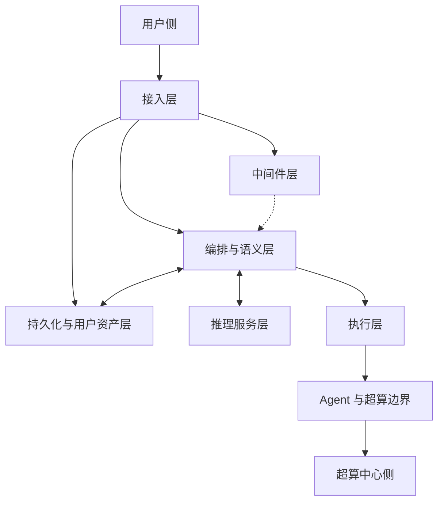

# 设计与模块（九大模块交互简图）

以下为**仅保留九大模块及其相互关系**的分层示意图；不包含各模块内部组件、契约说明与边上详细标注。详细展开仍以代码与架构文档为准。

```mermaid
flowchart TB
  U[用户侧]
  J[接入层]
  Z[中间件层]
  C[持久化与用户资产层]
  B[编排与语义层]
  T[推理服务层]
  X[执行层]
  G[Agent 与超算边界]
  S[超算中心侧]

  U --> J
  J --> Z
  J --> C
  J --> B
  B <--> T
  B <--> C
  B --> X
  X --> G
  G --> S
  Z -.-> B
```
