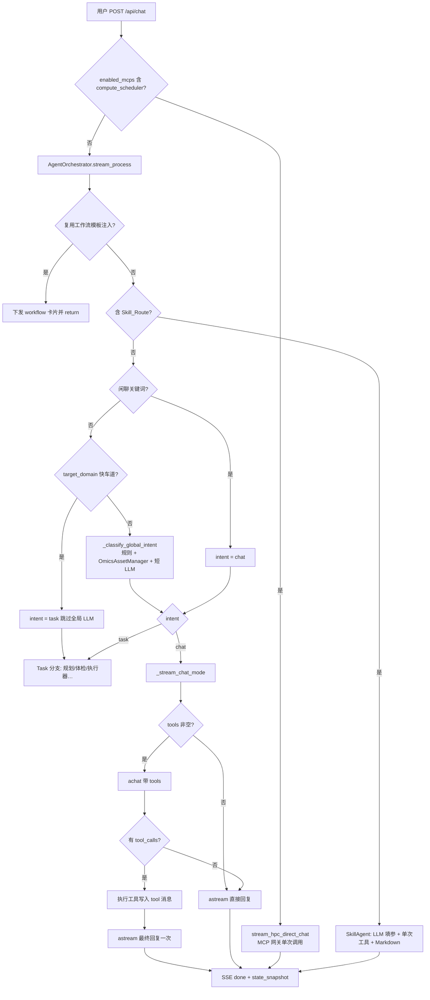

# 通用聊天路由（General Chat Routing）深度分析

> 基于仓库当前实现（以 `server.py` → `AgentOrchestrator.stream_process` 为主路径）的代码审阅结论。  
> 相关顶层约束见 `docs/ARCHITECTURE_CORE_PRINCIPLES.md`（技能快车道、TaaS、资产总线等）。

---

## 一、当前架构与完整链路

### 1.1 入口与分流

| 层级 | 位置 | 作用 |
|------|------|------|
| HTTP 入口 | `server.py` → `POST /api/chat` | 校验会话、落库用户消息、组装 `uploaded_files`、选择流式 SSE |
| HPC 隔离分流 | `gibh_agent/api/routers/chat.py` → `should_use_hpc_isolated_route` | 当 `enabled_mcps` 含 `compute_scheduler` 时，**整段跳过** `AgentOrchestrator`，改走 `gibh_agent.core.hpc_orchestrator.stream_hpc_direct_chat`（经 MCP 网关的单次工具式调用，非下文「主聊天编排器」路径） |
| 主编排器 | `gibh_agent/core/orchestrator.py` → `AgentOrchestrator.stream_process` | 统一 SSE、状态快照 `state_snapshot`、全局 **Chat vs Task** 决策与后续分支 |

**结论**：用户所说的「非 SOP 通用聊天」在**未开启 HPC 隔离**且**未命中技能暗号**时，由 `stream_process` 在 **Layer 0** 将全局意图判为 `chat` 后进入 `_stream_chat_mode`。

### 1.2 `stream_process` 内先于「全局 Chat/Task」的硬闸门（与通用聊天相关）

按代码顺序，下列逻辑会**先于** `_classify_global_intent` 执行或改变走向：

1. **路径规范化**：相对路径锚定 `upload_dir`（`stream_process` 开头）。
2. **历史截断**：`_truncate_and_sanitize_history`（头尾记忆 + 大 JSON 清洗），再传入后续分支。
3. **工作流收藏复用**：匹配 `[系统注入：用户请求复用工作流模板：…]` 时直接下发 DB 模板并 `return`（与通用闲聊无关，但占用路由优先级）。
4. **技能快车道**：正则 `[Skill_Route: tool_id]` → 实例化 `SkillAgent`，**不经过**全局 Chat/Task 分类（见 `gibh_agent/agents/skill_agent.py`）。这是「单工具 + LLM 填参」路径，不是 SOP，但也**不是**下文默认的 `_stream_chat_mode`。

### 1.3 Layer 0：全局意图 Chat vs Task（`_classify_global_intent`）

实现位置：`AgentOrchestrator._classify_global_intent`（`gibh_agent/core/orchestrator.py`）。

**决策顺序概要**：

1. **闲聊关键词**：`_global_chat_keyword_hit` → 直接 `chat`。
2. **BepiPred3 等技能意图**：`_is_bepipred3_skill_chat_intent` → 强制 `chat`（后续聊天模式会挂 `bepipred3_prediction` 工具）。
3. **资产嗅探 + 规则**：`OmicsAssetManager.classify_assets` + `ROUTING_NON_WORKFLOW_ASSET_TYPES` / `ROUTING_WORKFLOW_NATIVE_ASSET_TYPES`：  
   - 非工作流资产 + 模糊「帮我分析」类查询 → `chat`；  
   - 纯工作流原生资产集合 → `task`；  
   - 混合/非原生 → **LLM** 路由器（短 JSON，`temperature≈0.1`，`max_tokens≈80`）。
4. **公开数据库轻查询启发式**：`_is_public_api_chat_intent`（UniProt / Reactome / AlphaFold / MyGene 等）→ `chat`。
5. **任务向关键词**（analyze、PCA、工作流等）→ `task`。
6. **无文件且仍模糊**：再走一轮 **LLM** JSON 分类（`max_tokens≈50`）。

**`stream_process` 中与 `target_domain` 的交互**：

- 若请求带 **快车道** `target_domain`（非空），且**未**被全局闲聊关键词覆盖，则 **直接 `intent_type = "task"`**，**跳过** `_classify_global_intent` 的 LLM/规则调用（见 `stream_process` 中 `elif target_domain` 分支）。

### 1.4 通用聊天模式：`_stream_chat_mode`

当 `intent_type == "chat"` 时：

1. SSE：`status` →「正在思考…」
2. 调用 `_stream_chat_mode(query, files, history, llm_client, state_snapshot, model_name, enabled_mcps)`

**Prompt 组装要点**：

- **System**：友好助手 + 中文 + 固定「建议问题」块 `<<<SUGGESTIONS>>>…`；追加 MyGene/UniProt/Reactome/AlphaFold 等**必须先调工具**的说明；按 `enabled_mcps` 追加联网检索、NCBI、超算（`hpc_chat_system_suffix`）等后缀。
- **History**：仅取 **`history[-5:]`**（在 `_stream_chat_mode` 内），角色字段兼容 `content` / `message`。
- **User**：原始 `query`；若存在上传文件，前置 `_build_current_files_hint`（工作台挂载文件名提示）。

**工具列表（OpenAI `tools` 格式）**：

- 基线：`tool_names_to_openai_tools` 作用于 `_CHAT_MODE_PUBLIC_API_TOOLS`（`query_gene_info`、`query_uniprot_protein`、`query_reactome_pathway`、`query_alphafold_db`）。
- 条件追加：`mcp_web_search`、`mcp_ncbi_search`（由 `enabled_mcps` 决定）、BepiPred 意图下的 `bepipred3_prediction`、`apply_hpc_mcp_tool_policy` 注入的 `hpc_mcp_*`（仅当开启计算调度 MCP）。

**LLM 调用封装**（`gibh_agent/core/llm_client.py`）：

- `achat`：异步 `chat.completions.create`，可带 `tools` / `tool_choice`。
- `astream`：流式 `stream=True`，由 `stream_from_llm_chunks`（`gibh_agent/core/stream_utils.py`）拆出 `thought` / `message` 等 SSE 事件。

**实际执行形态（关键）**：

- 若**无任何工具**（列表为空）：单次 `astream(messages, …)` → 结束。
- 若有工具：  
  1. **一次非流式** `achat(messages, tools=tools, tool_choice=…)`；  
  2. 若返回 `tool_calls`：在 **同一轮 for 循环** 内对每个 `tool_call` 解析参数 → `registry.get_tool(name)` → 同步或 `await` 执行 → 将 `role: tool` 消息追加进 `messages`；  
  3. **再调用一次** `astream(messages, …)` 生成最终用户可见回复 → **函数返回**，不再把 `tools` 传给第二轮，也**没有**「模型看到 tool 结果后再次自主选择工具」的循环。

因此，通用聊天在工具维度上是 **「至多一轮 function calling + 一轮最终流式生成」**，不是任意步数的 Agent 循环。

### 1.5 端到端流程图（Mermaid）

### 1.6 与「另一条路由」的关系说明

- **`gibh_agent/main.py` 中 `GIBHAgent.process_query`**：经 `RouterAgent` 分发到各 `*Agent`，属于另一套入口形态；**当前 Web 主路径以 `server.py` + `AgentOrchestrator` 为准**（与 `docs/LLM_flow_metabolomics_analysis.md` 描述一致）。
- **Task（SOP）路径**上的多步行为由 **Planner + WorkflowExecutor** 承担，属于「工作流执行」而非本文件所指的「通用聊天路由」。

---

## 二、现状诊断

### 2.1 是否「简单的单次 LLM 调用」？

**不完全等同，但接近「浅层单次对话 + 可选固定两阶段工具」**：

- **无工具时**：一次流式生成，等价于**单次**模型调用（从业务语义上可称为单轮回复生成）。
- **有工具时**：**一次** `achat`（工具决策）+ **若干工具执行**（并行批次内顺序 for 循环）+ **一次** `astream`（总结）。  
  - 没有在第二轮生成后再次把 `tools` 开放给模型，**不支持**「根据第一次 tool 结果再决定调第二个、第三个工具」的开放循环。
- **全局路由**：在模糊场景下还有 **额外的短 LLM**（Chat/Task 分类），与聊天回复本身分离。

### 2.2 多步推理

- 模型内部的 **CoT / reasoning_content** 可通过 `stream_utils` 映射为 `thought` 事件，但这是**单次前向**内的隐式推理，**不是**显式规划步骤状态机。
- **无**独立的「计划—验证—再计划」循环（Task 路径上的 `QueryRewriter` / `Clarifier` / `Reflector` 在 `stream_process` 中位于 **chat 分支 return 之后**，**不作用于**通用聊天）。

### 2.3 工具回调

- 存在 **OpenAI 风格 function calling** 与 `ToolRegistry` 落地执行，但 **回调深度固定为 1 轮**（首轮决定是否调用；有则执行；再答一次即结束）。
- **技能快车道**为 **单一注册工具** 的执行管线：LLM 主要用于 **JSON 填参**，执行后 **不再**经 LLM 做长链式工具编排。

### 2.4 状态保持

- **会话级**：依赖客户端传入的 `history`；服务端在编排器内做 **截断与 JSON 清洗**，聊天子路径仅 **最近 5 条** 进入模型。
- **`state_snapshot`**：用于 SSE 聚合与入库展示（`text` / `reasoning` / `process_log` 等），**不是**跨轮自主 Agent 的「工作记忆」或「任务图」。
- **`conversation_state`**：在 Orchestrator 中主要服务 **Task/澄清** 等分支，**通用 chat 早退，不依赖该状态机延续多轮工具行为**。

---

## 三、与自主决策智能体（ReAct / 类 Cursor·Claude Code Agent）的差距

以下对照业界常见的 **Observation → Thought → Action** 闭环（及其实现形态：多轮 tool 循环、文件系统与命令沙箱、持久化任务状态等）。

| 维度 | 当前通用路由（`_stream_chat_mode`） | 典型自主 Agent（ReAct / IDE Agent） |
|------|-------------------------------------|-------------------------------------|
| **Observation** | 工具结果以 JSON 字符串塞入 **单轮** `messages`，仅再生成一次；无结构化「环境观测」层（目录列表、diff、命令退出码流等）的统一抽象 | 持续从环境读取状态；多轮观测驱动下一步 |
| **Thought** | 可能有流式 `thought`，但**无**与「下一步 Action」绑定的显式决策记录与校验 | 常显式记录推理步骤，并与工具选择对齐 |
| **Action** | Action 空间 = **预注册工具名列表**；执行一次批次即结束 | 多轮 Action；可组合搜索、读文件、写补丁、跑命令等 |
| **闭环** | **最多：决策 → 执行 → 总结**，无「总结后再调用工具」 | **while not done**：反复直到停止条件 |
| **目标与终止** | 隐式由模型在第二轮 `astream` 中自然结束 | 显式 stop 条件、步数上限、预算、用户中断 |
| **工具发现** | 固定集合 + MCP 开关；非动态 Tool-RAG（聊天路径） | 常结合检索、动态加载工具说明 |
| **安全与沙箱** | 工具自身负责（如 TaaS、MCP 网关）；聊天路径**无**统一「允许操作」策略引擎 | 沙箱、权限、路径白名单、审计日志 |

**与 Cursor / Claude Code 类产品的核心差异一句话**：后者是 **长时间运行、多轮工具、可修改环境与代码库** 的控制循环；当前通用路由是 **「路由 →（可选）单轮工具 → 答复」** 的对话式 API 组合。

---

## 四、演进建议：升级为「有限自主决策」需补充的基础设施

在**不破坏**现有 OmicsAssetManager、Executor 反射注入、TaaS 隔离等宪法前提下，若要将通用路由升级为 **可控的多步自主 Agent**，建议在现有 `ToolRegistry` / `LLMClient` / SSE 之上分层补齐：

### 4.1 循环控制与策略（必备）

- **显式 Agent 循环**：`while step < max_steps` 重复「`achat`/`astream` + tool_calls → 执行 → 写回 messages」，直至无 `tool_calls` 或命中终止条件。
- **终止条件**：最大步数、最大工具耗时、token 预算、用户取消、连续失败阈值。
- **与编排器集成**：在 `_stream_chat_mode` 外包一层 `ChatAgentRunner`，统一产出 `[AgenticLog]` 或等价 SSE，避免 `process_log` 爆炸（可复用 `SkillAgent` 节流思路）。

### 4.2 工具注册中心扩展（已有基础，需策略化）

- 现状：`gibh_agent/core/tool_registry.py` + `openai_tools.tool_names_to_openai_tools` 已能暴露 schema。
- 缺口：**按场景动态裁剪**（聊天 / 科研 / 超算）与 **能力标签**（只读 / 写文件 / 远程计算）；**禁止**在聊天循环里无差别注入重型或未审计工具。

### 4.3 上下文与记忆管理（必备）

- 现状：客户端 `history` + 本地截断；聊天仅用 5 条。
- 缺口：**会话级短期记忆**（含 tool 摘要压缩）、**跨轮任务状态**（与 `conversation_state` 对齐）、可选 **向量检索**（仅当产品需要「长文档+工具」而非违背现有架构）。

### 4.4 执行沙箱与审计（强烈建议）

- 对「读用户上传路径、写结果、子进程、MCP」统一 **允许列表与配额**；与 TaaS 原则一致：**重计算仍在 Worker/MCP**，主循环只编排。
- **结构化审计日志**：每步 tool 名、参数摘要、耗时、成功/失败，便于复现与合规。

### 4.5 规划与反思（可选增强）

- 将 `QueryRewriter` / `Reflector` **可选地**挂入 Chat 循环（小步计划 → 执行 → 对照目标反思），与 Task 路径解耦配置，避免拖慢纯闲聊。

### 4.6 与 HPC 隔离路径的统一语义

- `stream_hpc_direct_chat` 与主 Orchestrator **分流**；若未来统一 Agent 框架，需定义 **同一套** 事件与状态快照，避免两条路径前端与入库结构漂移。

---

## 五、关键源码锚点（便于对照）

| 主题 | 文件与符号 |
|------|------------|
| HTTP → 编排器 / HPC 分流 | `server.py`（`chat_endpoint`、`should_use_hpc_isolated_route`） |
| 全局 Chat/Task | `gibh_agent/core/orchestrator.py`：`stream_process`、`_classify_global_intent` |
| 通用聊天与工具两阶段 | 同上：`_stream_chat_mode`、`_CHAT_MODE_PUBLIC_API_TOOLS` |
| 工具 schema 组装 | `gibh_agent/core/openai_tools.py` |
| LLM 封装 | `gibh_agent/core/llm_client.py`：`achat`、`astream` |
| 技能快车道 | `gibh_agent/core/orchestrator.py`（`Skill_Route`）、`gibh_agent/agents/skill_agent.py` |
| HPC 直连聊天 | `gibh_agent/core/hpc_orchestrator.py`：`stream_hpc_direct_chat` |
| 架构原则（快车道、资产总线） | `docs/ARCHITECTURE_CORE_PRINCIPLES.md` |

---

*文档生成说明：基于仓库静态代码分析；若后续改动 `stream_process` / `_stream_chat_mode` 行为，请同步更新本节与流程图。*
